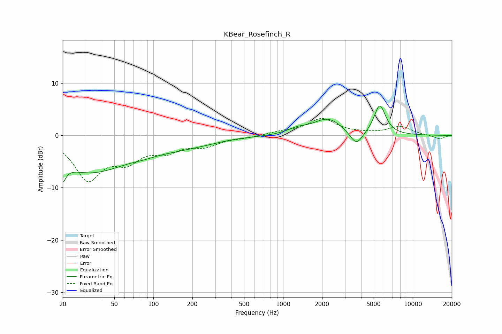

# KBear_Rosefinch_R
See [usage instructions](https://github.com/jaakkopasanen/AutoEq#usage) for more options and info.

### Parametric EQs
Apply preamp of -5.7 dB when using parametric equalizer.

|   # | Type    |   Fc (Hz) |    Q |   Gain (dB) |
|-----|---------|-----------|------|-------------|
|   1 | Peaking |        20 | 5.64 |        -6.7 |
|   2 | Peaking |        20 | 5.81 |         3.3 |
|   3 | Peaking |        32 | 0.48 |        -6.7 |
|   4 | Peaking |        84 | 1.82 |        -0.3 |
|   5 | Peaking |       161 | 0.48 |        -1.9 |
|   6 | Peaking |       405 | 1.32 |         0.2 |
|   7 | Peaking |      1292 | 1.84 |         0.9 |
|   8 | Peaking |      2219 | 1.26 |         3.1 |
|   9 | Peaking |      3677 | 2.74 |        -2.9 |
|  10 | Peaking |      5569 | 3.09 |         5.7 |

### Fixed Band EQs
When using fixed band (also called graphic) equalizer, apply preamp of **-3.3 dB** (if available) and set gains manually with these parameters.

|   # | Type    |   Fc (Hz) |    Q |   Gain (dB) |
|-----|---------|-----------|------|-------------|
|   1 | Peaking |        31 | 1.41 |        -8   |
|   2 | Peaking |        62 | 1.41 |        -4   |
|   3 | Peaking |       125 | 1.41 |        -2.5 |
|   4 | Peaking |       250 | 1.41 |        -1.7 |
|   5 | Peaking |       500 | 1.41 |        -0.3 |
|   6 | Peaking |      1000 | 1.41 |         0.6 |
|   7 | Peaking |      2000 | 1.41 |         3.1 |
|   8 | Peaking |      4000 | 1.41 |         0.2 |
|   9 | Peaking |      8000 | 1.41 |         1.6 |
|  10 | Peaking |     16000 | 1.41 |        -0.7 |

### Graphs

