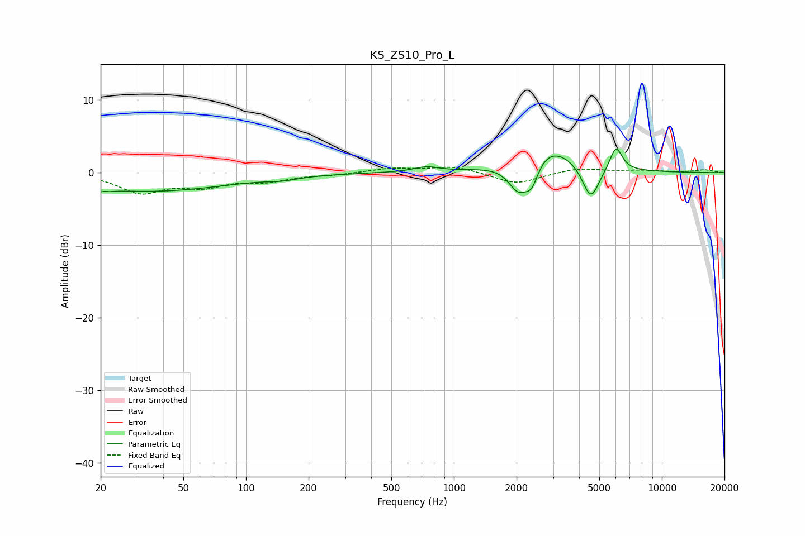

# KS_ZS10_Pro_L
See [usage instructions](https://github.com/jaakkopasanen/AutoEq#usage) for more options and info.

### Parametric EQs
Apply preamp of -3.3 dB when using parametric equalizer.

|   # | Type    |   Fc (Hz) |    Q |   Gain (dB) |
|-----|---------|-----------|------|-------------|
|   1 | Peaking |        20 | 5.07 |        -2.8 |
|   2 | Peaking |        20 | 5.98 |         2.3 |
|   3 | Peaking |        35 | 0.37 |        -2.5 |
|   4 | Peaking |       150 | 1.91 |        -0.4 |
|   5 | Peaking |       736 | 2.35 |         0.7 |
|   6 | Peaking |      2043 | 2.8  |        -4.2 |
|   7 | Peaking |      2367 | 4.26 |        -3.1 |
|   8 | Peaking |      2798 | 1.04 |         4.1 |
|   9 | Peaking |      4551 | 3.38 |        -4.9 |
|  10 | Peaking |      6015 | 4.68 |         3.4 |

### Fixed Band EQs
When using fixed band (also called graphic) equalizer, apply preamp of **-0.8 dB** (if available) and set gains manually with these parameters.

|   # | Type    |   Fc (Hz) |    Q |   Gain (dB) |
|-----|---------|-----------|------|-------------|
|   1 | Peaking |        31 | 1.41 |        -2.6 |
|   2 | Peaking |        62 | 1.41 |        -1.6 |
|   3 | Peaking |       125 | 1.41 |        -1   |
|   4 | Peaking |       250 | 1.41 |        -0.3 |
|   5 | Peaking |       500 | 1.41 |         0.6 |
|   6 | Peaking |      1000 | 1.41 |         0.9 |
|   7 | Peaking |      2000 | 1.41 |        -1.6 |
|   8 | Peaking |      4000 | 1.41 |         0.7 |
|   9 | Peaking |      8000 | 1.41 |         0.3 |
|  10 | Peaking |     16000 | 1.41 |         0.4 |

### Graphs

