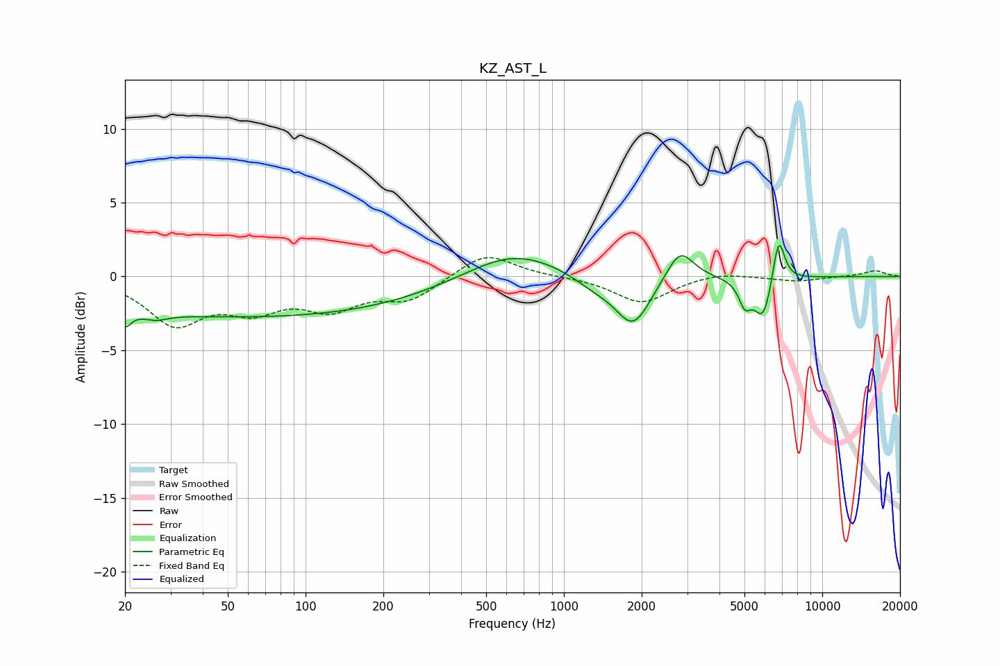

# KZ_AST_L
See [usage instructions](https://github.com/jaakkopasanen/AutoEq#usage) for more options and info.

### Parametric EQs
Apply preamp of -2.2 dB when using parametric equalizer.

|   # | Type    |   Fc (Hz) |    Q |   Gain (dB) |
|-----|---------|-----------|------|-------------|
|   1 | Peaking |        20 | 5.91 |        -1.1 |
|   2 | Peaking |        26 | 2.92 |        -0.5 |
|   3 | Peaking |        62 | 0.18 |        -2.7 |
|   4 | Peaking |       634 | 0.74 |         2   |
|   5 | Peaking |      1316 | 1.57 |        -0.8 |
|   6 | Peaking |      1855 | 2.08 |        -3.3 |
|   7 | Peaking |      2815 | 2.68 |         2.2 |
|   8 | Peaking |      5019 | 5.86 |        -1.5 |
|   9 | Peaking |      5910 | 3.79 |        -2.9 |
|  10 | Peaking |      6776 | 5.75 |         3.4 |

### Fixed Band EQs
When using fixed band (also called graphic) equalizer, apply preamp of **-1.4 dB** (if available) and set gains manually with these parameters.

|   # | Type    |   Fc (Hz) |    Q |   Gain (dB) |
|-----|---------|-----------|------|-------------|
|   1 | Peaking |        31 | 1.41 |        -3   |
|   2 | Peaking |        62 | 1.41 |        -1.9 |
|   3 | Peaking |       125 | 1.41 |        -1.9 |
|   4 | Peaking |       250 | 1.41 |        -1.5 |
|   5 | Peaking |       500 | 1.41 |         1.7 |
|   6 | Peaking |      1000 | 1.41 |         0   |
|   7 | Peaking |      2000 | 1.41 |        -1.8 |
|   8 | Peaking |      4000 | 1.41 |         0.3 |
|   9 | Peaking |      8000 | 1.41 |        -0.3 |
|  10 | Peaking |     16000 | 1.41 |         0.4 |

### Graphs

