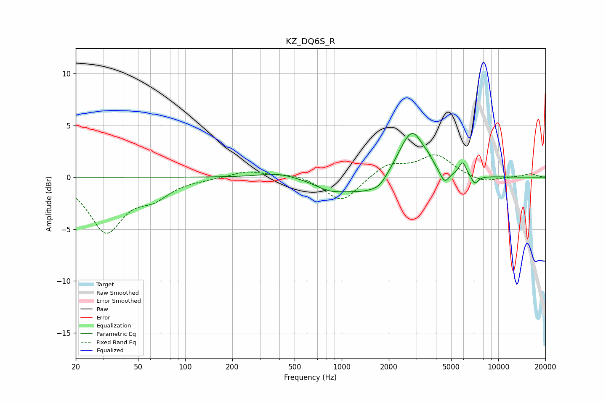

# KZ_DQ6S_R
See [usage instructions](https://github.com/jaakkopasanen/AutoEq#usage) for more options and info.

### Parametric EQs
Apply preamp of -4.3 dB when using parametric equalizer.

|   # | Type    |   Fc (Hz) |    Q |   Gain (dB) |
|-----|---------|-----------|------|-------------|
|   1 | Peaking |       391 | 1.19 |         0.5 |
|   2 | Peaking |       831 | 1.56 |        -0.7 |
|   3 | Peaking |      1522 | 0.82 |        -1.8 |
|   4 | Peaking |      1739 | 3.5  |        -0.4 |
|   5 | Peaking |      2368 | 1.63 |         1.3 |
|   6 | Peaking |      2845 | 1.96 |         4.1 |
|   7 | Peaking |      3567 | 4.39 |         0.4 |
|   8 | Peaking |      4531 | 4.98 |        -1.2 |
|   9 | Peaking |      5916 | 6    |         1.3 |
|  10 | Peaking |      7088 | 6    |        -0.8 |

### Fixed Band EQs
When using fixed band (also called graphic) equalizer, apply preamp of **-2.3 dB** (if available) and set gains manually with these parameters.

|   # | Type    |   Fc (Hz) |    Q |   Gain (dB) |
|-----|---------|-----------|------|-------------|
|   1 | Peaking |        31 | 1.41 |        -5.1 |
|   2 | Peaking |        62 | 1.41 |        -1.6 |
|   3 | Peaking |       125 | 1.41 |        -0.1 |
|   4 | Peaking |       250 | 1.41 |         0.6 |
|   5 | Peaking |       500 | 1.41 |         0.4 |
|   6 | Peaking |      1000 | 1.41 |        -2.5 |
|   7 | Peaking |      2000 | 1.41 |         1.3 |
|   8 | Peaking |      4000 | 1.41 |         2.1 |
|   9 | Peaking |      8000 | 1.41 |        -0.6 |
|  10 | Peaking |     16000 | 1.41 |         0.3 |

### Graphs

