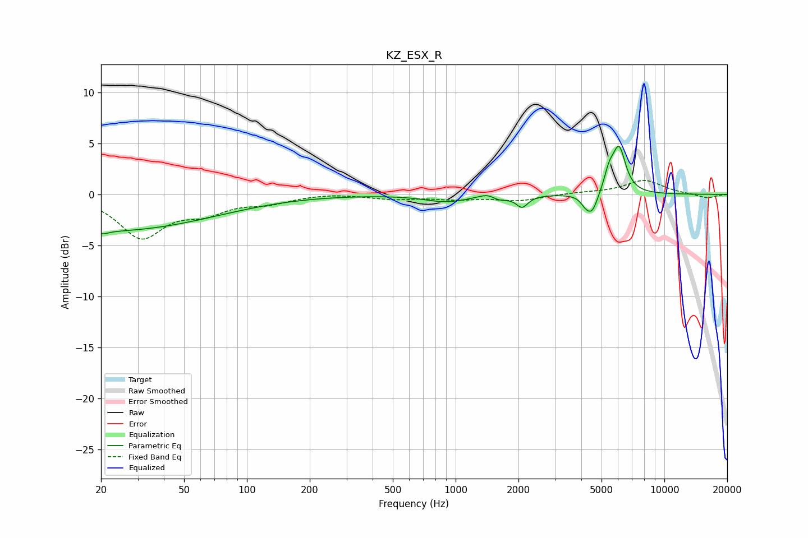

# KZ_ESX_R
See [usage instructions](https://github.com/jaakkopasanen/AutoEq#usage) for more options and info.

### Parametric EQs
Apply preamp of -4.8 dB when using parametric equalizer.

|   # | Type    |   Fc (Hz) |    Q |   Gain (dB) |
|-----|---------|-----------|------|-------------|
|   1 | Peaking |        20 | 0.25 |        -3.6 |
|   2 | Peaking |        20 | 5.41 |        -0.3 |
|   3 | Peaking |       902 | 1.39 |        -0.7 |
|   4 | Peaking |      1457 | 3.22 |         0.7 |
|   5 | Peaking |      1574 | 3.07 |        -0.7 |
|   6 | Peaking |      2083 | 5.19 |        -1.1 |
|   7 | Peaking |      4188 | 5.99 |        -0.7 |
|   8 | Peaking |      4514 | 4.9  |        -1.9 |
|   9 | Peaking |      5435 | 5.98 |         1.6 |
|  10 | Peaking |      6067 | 4.35 |         4.4 |

### Fixed Band EQs
When using fixed band (also called graphic) equalizer, apply preamp of **-1.5 dB** (if available) and set gains manually with these parameters.

|   # | Type    |   Fc (Hz) |    Q |   Gain (dB) |
|-----|---------|-----------|------|-------------|
|   1 | Peaking |        31 | 1.41 |        -4.1 |
|   2 | Peaking |        62 | 1.41 |        -1.5 |
|   3 | Peaking |       125 | 1.41 |        -0.7 |
|   4 | Peaking |       250 | 1.41 |         0.2 |
|   5 | Peaking |       500 | 1.41 |        -0.4 |
|   6 | Peaking |      1000 | 1.41 |        -0.4 |
|   7 | Peaking |      2000 | 1.41 |        -0.6 |
|   8 | Peaking |      4000 | 1.41 |         0.1 |
|   9 | Peaking |      8000 | 1.41 |         1.4 |
|  10 | Peaking |     16000 | 1.41 |        -0.4 |

### Graphs

