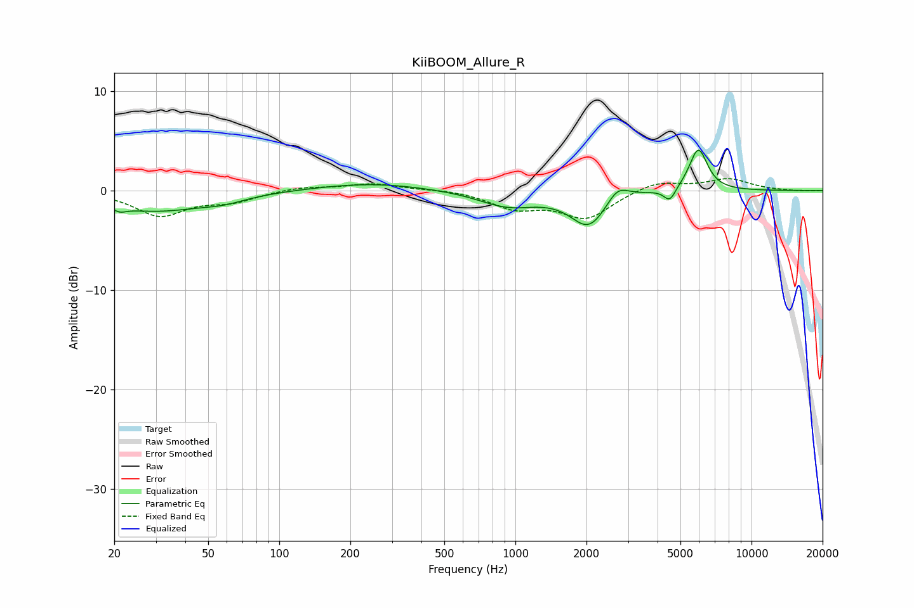

# KiiBOOM_Allure_R
See [usage instructions](https://github.com/jaakkopasanen/AutoEq#usage) for more options and info.

### Parametric EQs
Apply preamp of -4.2 dB when using parametric equalizer.

|   # | Type    |   Fc (Hz) |    Q |   Gain (dB) |
|-----|---------|-----------|------|-------------|
|   1 | Peaking |        21 | 5.84 |        -2   |
|   2 | Peaking |        21 | 5.99 |         1.5 |
|   3 | Peaking |        29 | 0.64 |        -2   |
|   4 | Peaking |        58 | 1.51 |        -0.5 |
|   5 | Peaking |       246 | 0.61 |         0.8 |
|   6 | Peaking |       931 | 1.13 |        -1.6 |
|   7 | Peaking |      2049 | 1.84 |        -3.5 |
|   8 | Peaking |      2707 | 3.01 |         1.6 |
|   9 | Peaking |      4506 | 5.7  |        -1.3 |
|  10 | Peaking |      5953 | 3.58 |         4.3 |

### Fixed Band EQs
When using fixed band (also called graphic) equalizer, apply preamp of **-1.3 dB** (if available) and set gains manually with these parameters.

|   # | Type    |   Fc (Hz) |    Q |   Gain (dB) |
|-----|---------|-----------|------|-------------|
|   1 | Peaking |        31 | 1.41 |        -2.5 |
|   2 | Peaking |        62 | 1.41 |        -1   |
|   3 | Peaking |       125 | 1.41 |         0.4 |
|   4 | Peaking |       250 | 1.41 |         0.7 |
|   5 | Peaking |       500 | 1.41 |         0.2 |
|   6 | Peaking |      1000 | 1.41 |        -1.6 |
|   7 | Peaking |      2000 | 1.41 |        -2.7 |
|   8 | Peaking |      4000 | 1.41 |         1   |
|   9 | Peaking |      8000 | 1.41 |         1.1 |
|  10 | Peaking |     16000 | 1.41 |        -0.1 |

### Graphs

