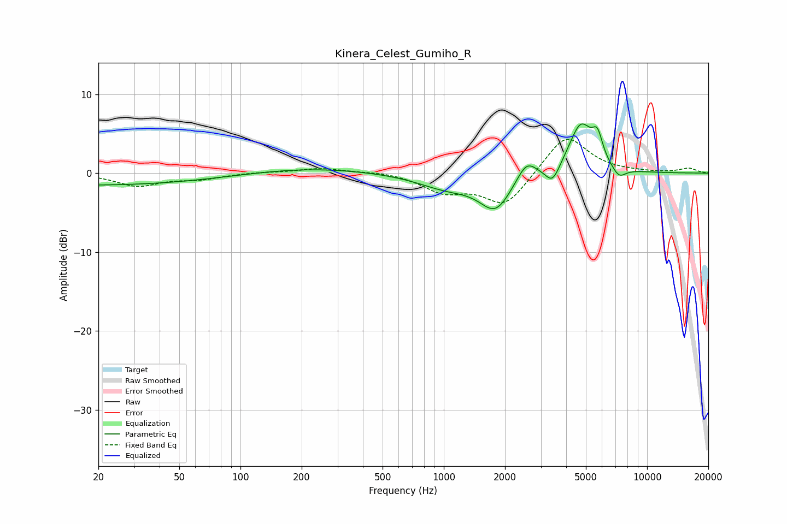

# Kinera_Celest_Gumiho_R
See [usage instructions](https://github.com/jaakkopasanen/AutoEq#usage) for more options and info.

### Parametric EQs
Apply preamp of -6.3 dB when using parametric equalizer.

|   # | Type    |   Fc (Hz) |    Q |   Gain (dB) |
|-----|---------|-----------|------|-------------|
|   1 | Peaking |        20 | 0.24 |        -1.5 |
|   2 | Peaking |        21 | 4.63 |        -0   |
|   3 | Peaking |       214 | 0.49 |         0.7 |
|   4 | Peaking |      1041 | 0.96 |        -1.8 |
|   5 | Peaking |      1798 | 1.82 |        -4.3 |
|   6 | Peaking |      2551 | 2.97 |         2.4 |
|   7 | Peaking |      3428 | 4.06 |        -2.2 |
|   8 | Peaking |      4721 | 2.34 |         6.2 |
|   9 | Peaking |      5702 | 5.45 |         3   |
|  10 | Peaking |      7267 | 4.01 |        -1.3 |

### Fixed Band EQs
When using fixed band (also called graphic) equalizer, apply preamp of **-4.4 dB** (if available) and set gains manually with these parameters.

|   # | Type    |   Fc (Hz) |    Q |   Gain (dB) |
|-----|---------|-----------|------|-------------|
|   1 | Peaking |        31 | 1.41 |        -1.6 |
|   2 | Peaking |        62 | 1.41 |        -0.7 |
|   3 | Peaking |       125 | 1.41 |         0.1 |
|   4 | Peaking |       250 | 1.41 |         0.6 |
|   5 | Peaking |       500 | 1.41 |         0.3 |
|   6 | Peaking |      1000 | 1.41 |        -2.2 |
|   7 | Peaking |      2000 | 1.41 |        -4.2 |
|   8 | Peaking |      4000 | 1.41 |         5   |
|   9 | Peaking |      8000 | 1.41 |         0.1 |
|  10 | Peaking |     16000 | 1.41 |         0.6 |

### Graphs

