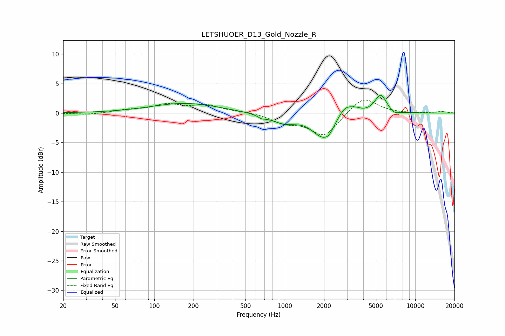

# LETSHUOER_D13_Gold_Nozzle_R
See [usage instructions](https://github.com/jaakkopasanen/AutoEq#usage) for more options and info.

### Parametric EQs
Apply preamp of -3.1 dB when using parametric equalizer.

|   # | Type    |   Fc (Hz) |    Q |   Gain (dB) |
|-----|---------|-----------|------|-------------|
|   1 | Peaking |       172 | 0.55 |         1.7 |
|   2 | Peaking |       664 | 5.22 |        -0.4 |
|   3 | Peaking |       979 | 1.32 |        -1.5 |
|   4 | Peaking |      1451 | 2.17 |         0.1 |
|   5 | Peaking |      1991 | 1.58 |        -4.2 |
|   6 | Peaking |      2184 | 5    |        -0.6 |
|   7 | Peaking |      2912 | 2.25 |         2.3 |
|   8 | Peaking |      3557 | 4.13 |         0.4 |
|   9 | Peaking |      5440 | 3.03 |         3.2 |
|  10 | Peaking |      6900 | 3.76 |        -0.6 |

### Fixed Band EQs
When using fixed band (also called graphic) equalizer, apply preamp of **-2.3 dB** (if available) and set gains manually with these parameters.

|   # | Type    |   Fc (Hz) |    Q |   Gain (dB) |
|-----|---------|-----------|------|-------------|
|   1 | Peaking |        31 | 1.41 |        -0.3 |
|   2 | Peaking |        62 | 1.41 |         0.4 |
|   3 | Peaking |       125 | 1.41 |         1.3 |
|   4 | Peaking |       250 | 1.41 |         1.2 |
|   5 | Peaking |       500 | 1.41 |         0.2 |
|   6 | Peaking |      1000 | 1.41 |        -1.5 |
|   7 | Peaking |      2000 | 1.41 |        -3.9 |
|   8 | Peaking |      4000 | 1.41 |         2.9 |
|   9 | Peaking |      8000 | 1.41 |        -0.1 |
|  10 | Peaking |     16000 | 1.41 |         0.2 |

### Graphs

