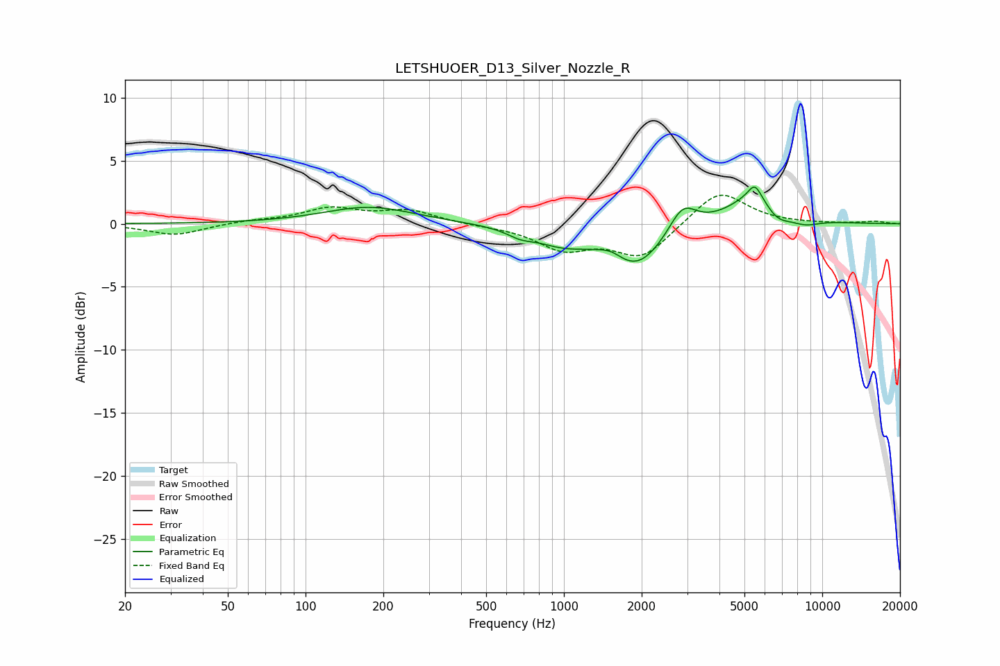

# LETSHUOER_D13_Silver_Nozzle_R
See [usage instructions](https://github.com/jaakkopasanen/AutoEq#usage) for more options and info.

### Parametric EQs
Apply preamp of -3.0 dB when using parametric equalizer.

|   # | Type    |   Fc (Hz) |    Q |   Gain (dB) |
|-----|---------|-----------|------|-------------|
|   1 | Peaking |       176 | 0.8  |         1.3 |
|   2 | Peaking |       676 | 2.89 |        -0.5 |
|   3 | Peaking |       987 | 1.24 |        -1.3 |
|   4 | Peaking |      1526 | 3.11 |         0.5 |
|   5 | Peaking |      1911 | 1.32 |        -3.3 |
|   6 | Peaking |      2881 | 2.69 |         2.2 |
|   7 | Peaking |      5479 | 5.7  |         1   |
|   8 | Peaking |      5772 | 1.34 |         3.2 |
|   9 | Peaking |      6592 | 2.25 |        -1.9 |
|  10 | Peaking |      8535 | 2.14 |        -0.6 |

### Fixed Band EQs
When using fixed band (also called graphic) equalizer, apply preamp of **-2.4 dB** (if available) and set gains manually with these parameters.

|   # | Type    |   Fc (Hz) |    Q |   Gain (dB) |
|-----|---------|-----------|------|-------------|
|   1 | Peaking |        31 | 1.41 |        -0.9 |
|   2 | Peaking |        62 | 1.41 |         0.2 |
|   3 | Peaking |       125 | 1.41 |         1.2 |
|   4 | Peaking |       250 | 1.41 |         1   |
|   5 | Peaking |       500 | 1.41 |        -0.1 |
|   6 | Peaking |      1000 | 1.41 |        -1.9 |
|   7 | Peaking |      2000 | 1.41 |        -2.6 |
|   8 | Peaking |      4000 | 1.41 |         2.8 |
|   9 | Peaking |      8000 | 1.41 |         0   |
|  10 | Peaking |     16000 | 1.41 |         0.2 |

### Graphs

