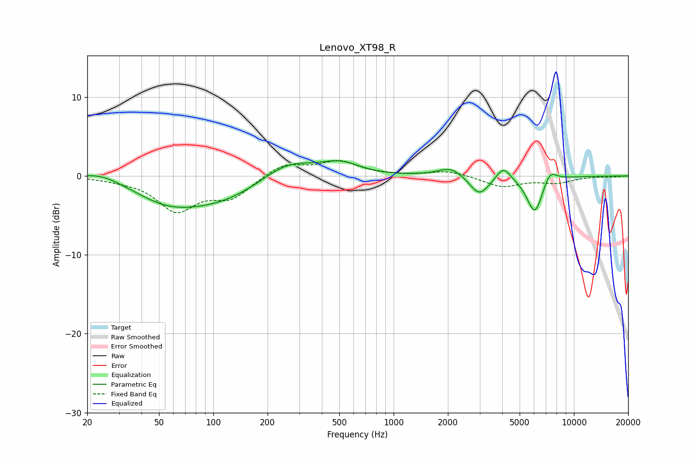

# Lenovo_XT98_R
See [usage instructions](https://github.com/jaakkopasanen/AutoEq#usage) for more options and info.

### Parametric EQs
Apply preamp of -2.0 dB when using parametric equalizer.

|   # | Type    |   Fc (Hz) |    Q |   Gain (dB) |
|-----|---------|-----------|------|-------------|
|   1 | Peaking |        24 | 1.33 |         1   |
|   2 | Peaking |        54 | 0.88 |        -1.8 |
|   3 | Peaking |       101 | 0.52 |        -3.3 |
|   4 | Peaking |       257 | 0.95 |         2.5 |
|   5 | Peaking |       506 | 1.33 |         1.5 |
|   6 | Peaking |      2080 | 2.05 |         1.2 |
|   7 | Peaking |      2990 | 2.62 |        -2.5 |
|   8 | Peaking |      4064 | 3.62 |         1.7 |
|   9 | Peaking |      6067 | 3.07 |        -4.8 |
|  10 | Peaking |      7357 | 3.73 |         1.6 |

### Fixed Band EQs
When using fixed band (also called graphic) equalizer, apply preamp of **-2.1 dB** (if available) and set gains manually with these parameters.

|   # | Type    |   Fc (Hz) |    Q |   Gain (dB) |
|-----|---------|-----------|------|-------------|
|   1 | Peaking |        31 | 1.41 |        -0.3 |
|   2 | Peaking |        62 | 1.41 |        -4.2 |
|   3 | Peaking |       125 | 1.41 |        -2.6 |
|   4 | Peaking |       250 | 1.41 |         1.6 |
|   5 | Peaking |       500 | 1.41 |         1.8 |
|   6 | Peaking |      1000 | 1.41 |        -0   |
|   7 | Peaking |      2000 | 1.41 |         0.7 |
|   8 | Peaking |      4000 | 1.41 |        -1.4 |
|   9 | Peaking |      8000 | 1.41 |        -0.8 |
|  10 | Peaking |     16000 | 1.41 |        -0.1 |

### Graphs

