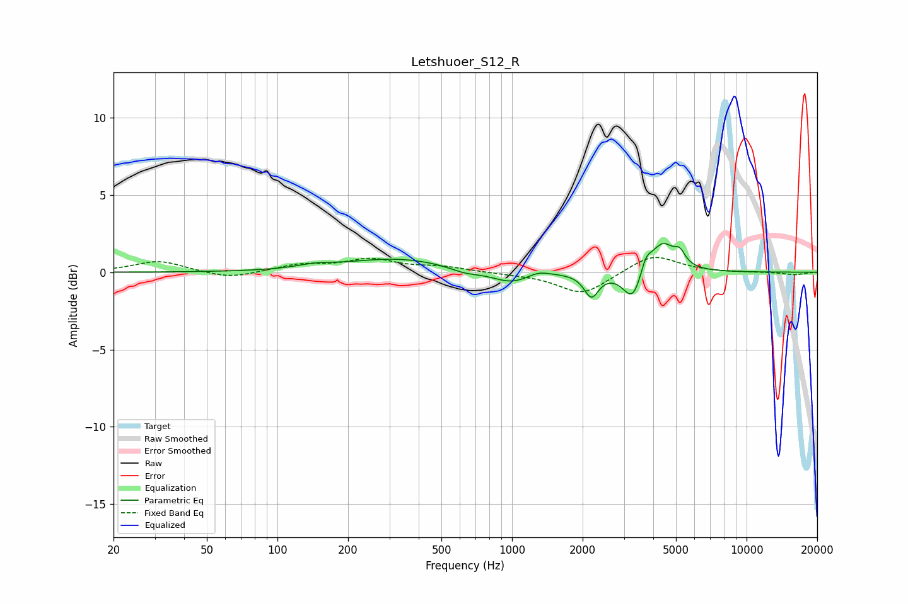

# Letshuoer_S12_R
See [usage instructions](https://github.com/jaakkopasanen/AutoEq#usage) for more options and info.

### Parametric EQs
Apply preamp of -2.0 dB when using parametric equalizer.

|   # | Type    |   Fc (Hz) |    Q |   Gain (dB) |
|-----|---------|-----------|------|-------------|
|   1 | Peaking |       145 | 1.85 |         0.2 |
|   2 | Peaking |       326 | 0.65 |         0.9 |
|   3 | Peaking |       627 | 2.21 |        -0.3 |
|   4 | Peaking |       996 | 1.64 |        -0.8 |
|   5 | Peaking |      1292 | 3.01 |         0.3 |
|   6 | Peaking |      2180 | 4.62 |        -1.5 |
|   7 | Peaking |      3276 | 3.47 |        -2   |
|   8 | Peaking |      3721 | 6    |         1   |
|   9 | Peaking |      4375 | 2.72 |         1.9 |
|  10 | Peaking |      5190 | 6    |         0.8 |

### Fixed Band EQs
When using fixed band (also called graphic) equalizer, apply preamp of **-1.1 dB** (if available) and set gains manually with these parameters.

|   # | Type    |   Fc (Hz) |    Q |   Gain (dB) |
|-----|---------|-----------|------|-------------|
|   1 | Peaking |        31 | 1.41 |         0.7 |
|   2 | Peaking |        62 | 1.41 |        -0.5 |
|   3 | Peaking |       125 | 1.41 |         0.5 |
|   4 | Peaking |       250 | 1.41 |         0.8 |
|   5 | Peaking |       500 | 1.41 |         0.3 |
|   6 | Peaking |      1000 | 1.41 |        -0.1 |
|   7 | Peaking |      2000 | 1.41 |        -1.5 |
|   8 | Peaking |      4000 | 1.41 |         1.2 |
|   9 | Peaking |      8000 | 1.41 |        -0   |
|  10 | Peaking |     16000 | 1.41 |        -0.2 |

### Graphs

