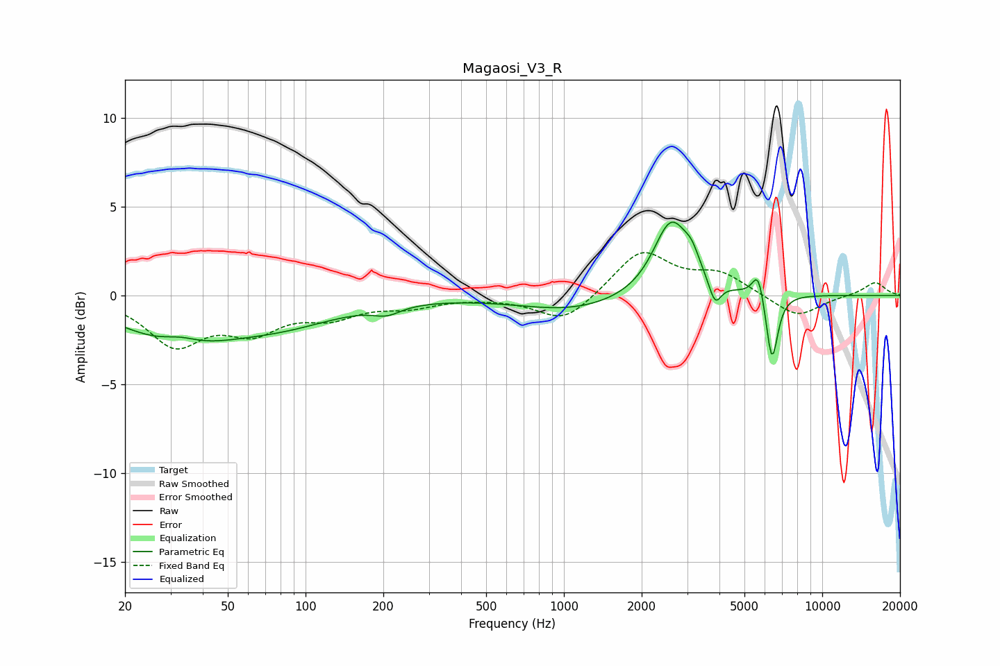

# Magaosi_V3_R
See [usage instructions](https://github.com/jaakkopasanen/AutoEq#usage) for more options and info.

### Parametric EQs
Apply preamp of -4.2 dB when using parametric equalizer.

|   # | Type    |   Fc (Hz) |    Q |   Gain (dB) |
|-----|---------|-----------|------|-------------|
|   1 | Peaking |        32 | 0.69 |        -2.5 |
|   2 | Peaking |        33 | 1.85 |         0.6 |
|   3 | Peaking |        82 | 0.62 |        -1.3 |
|   4 | Peaking |       206 | 2.61 |        -0.5 |
|   5 | Peaking |      1084 | 0.68 |        -0.8 |
|   6 | Peaking |      2602 | 2.06 |         4.3 |
|   7 | Peaking |      3129 | 4.63 |         0.9 |
|   8 | Peaking |      3847 | 6    |        -1.3 |
|   9 | Peaking |      5657 | 5.95 |         1.6 |
|  10 | Peaking |      6388 | 6    |        -3.9 |

### Fixed Band EQs
When using fixed band (also called graphic) equalizer, apply preamp of **-2.5 dB** (if available) and set gains manually with these parameters.

|   # | Type    |   Fc (Hz) |    Q |   Gain (dB) |
|-----|---------|-----------|------|-------------|
|   1 | Peaking |        31 | 1.41 |        -2.6 |
|   2 | Peaking |        62 | 1.41 |        -1.7 |
|   3 | Peaking |       125 | 1.41 |        -1   |
|   4 | Peaking |       250 | 1.41 |        -0.5 |
|   5 | Peaking |       500 | 1.41 |        -0.1 |
|   6 | Peaking |      1000 | 1.41 |        -1.5 |
|   7 | Peaking |      2000 | 1.41 |         2.5 |
|   8 | Peaking |      4000 | 1.41 |         1.2 |
|   9 | Peaking |      8000 | 1.41 |        -1.3 |
|  10 | Peaking |     16000 | 1.41 |         0.8 |

### Graphs

