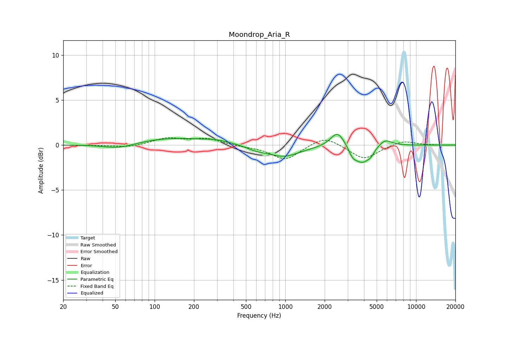

# Moondrop_Aria_R
See [usage instructions](https://github.com/jaakkopasanen/AutoEq#usage) for more options and info.

### Parametric EQs
Apply preamp of -1.3 dB when using parametric equalizer.

|   # | Type    |   Fc (Hz) |    Q |   Gain (dB) |
|-----|---------|-----------|------|-------------|
|   1 | Peaking |        53 | 1.2  |        -0.6 |
|   2 | Peaking |       133 | 0.54 |         0.8 |
|   3 | Peaking |       298 | 1.33 |         0.3 |
|   4 | Peaking |       596 | 2.28 |        -0.3 |
|   5 | Peaking |       964 | 1.09 |        -1.3 |
|   6 | Peaking |      2513 | 2.68 |         1.7 |
|   7 | Peaking |      3281 | 4.56 |        -0.9 |
|   8 | Peaking |      3878 | 2.48 |        -1.8 |
|   9 | Peaking |      4505 | 5.23 |        -0.5 |
|  10 | Peaking |      5804 | 2.69 |         0.8 |

### Fixed Band EQs
When using fixed band (also called graphic) equalizer, apply preamp of **-0.9 dB** (if available) and set gains manually with these parameters.

|   # | Type    |   Fc (Hz) |    Q |   Gain (dB) |
|-----|---------|-----------|------|-------------|
|   1 | Peaking |        31 | 1.41 |        -0   |
|   2 | Peaking |        62 | 1.41 |        -0.3 |
|   3 | Peaking |       125 | 1.41 |         0.8 |
|   4 | Peaking |       250 | 1.41 |         0.7 |
|   5 | Peaking |       500 | 1.41 |        -0.1 |
|   6 | Peaking |      1000 | 1.41 |        -1.7 |
|   7 | Peaking |      2000 | 1.41 |         1.1 |
|   8 | Peaking |      4000 | 1.41 |        -1.6 |
|   9 | Peaking |      8000 | 1.41 |         0.5 |
|  10 | Peaking |     16000 | 1.41 |        -0   |

### Graphs

