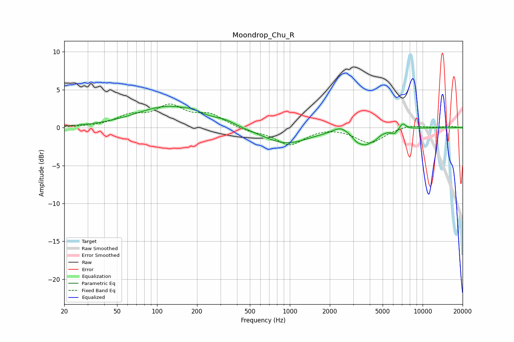

# Moondrop_Chu_R
See [usage instructions](https://github.com/jaakkopasanen/AutoEq#usage) for more options and info.

### Parametric EQs
Apply preamp of -2.9 dB when using parametric equalizer.

|   # | Type    |   Fc (Hz) |    Q |   Gain (dB) |
|-----|---------|-----------|------|-------------|
|   1 | Peaking |       124 | 0.57 |         2.8 |
|   2 | Peaking |       185 | 4.15 |         0.3 |
|   3 | Peaking |       326 | 2.17 |         0.4 |
|   4 | Peaking |       929 | 0.8  |        -2.1 |
|   5 | Peaking |      2401 | 2.69 |         0.8 |
|   6 | Peaking |      3165 | 5.9  |        -0.4 |
|   7 | Peaking |      3666 | 2.09 |        -2   |
|   8 | Peaking |      4410 | 4.86 |        -0.3 |
|   9 | Peaking |      6139 | 6    |        -0.6 |
|  10 | Peaking |      7086 | 5.99 |         0.8 |

### Fixed Band EQs
When using fixed band (also called graphic) equalizer, apply preamp of **-3.2 dB** (if available) and set gains manually with these parameters.

|   # | Type    |   Fc (Hz) |    Q |   Gain (dB) |
|-----|---------|-----------|------|-------------|
|   1 | Peaking |        31 | 1.41 |         0   |
|   2 | Peaking |        62 | 1.41 |         1.4 |
|   3 | Peaking |       125 | 1.41 |         2.6 |
|   4 | Peaking |       250 | 1.41 |         1.5 |
|   5 | Peaking |       500 | 1.41 |        -0.5 |
|   6 | Peaking |      1000 | 1.41 |        -2.2 |
|   7 | Peaking |      2000 | 1.41 |         0.2 |
|   8 | Peaking |      4000 | 1.41 |        -2   |
|   9 | Peaking |      8000 | 1.41 |         0.4 |
|  10 | Peaking |     16000 | 1.41 |         0.2 |

### Graphs

