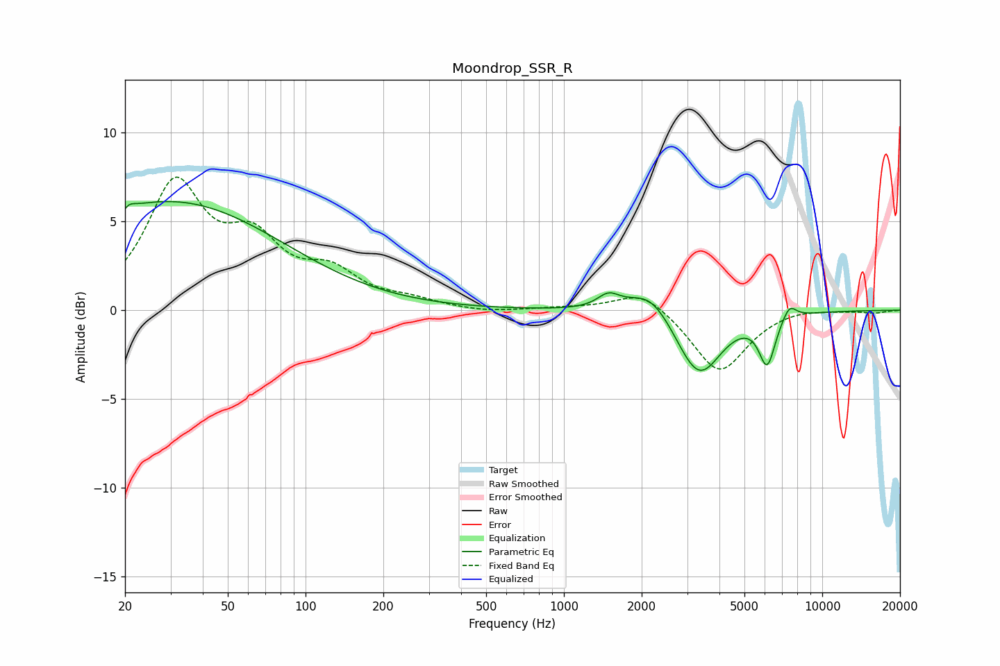

# Moondrop_SSR_R
See [usage instructions](https://github.com/jaakkopasanen/AutoEq#usage) for more options and info.

### Parametric EQs
Apply preamp of -6.2 dB when using parametric equalizer.

|   # | Type    |   Fc (Hz) |    Q |   Gain (dB) |
|-----|---------|-----------|------|-------------|
|   1 | Peaking |        20 | 5.96 |        -3.3 |
|   2 | Peaking |        20 | 5.87 |         3.3 |
|   3 | Peaking |        20 | 0.31 |         0.8 |
|   4 | Peaking |        31 | 0.33 |         5.3 |
|   5 | Peaking |      1488 | 3.29 |         0.8 |
|   6 | Peaking |      2158 | 1.7  |         1.5 |
|   7 | Peaking |      3089 | 1.81 |        -0.6 |
|   8 | Peaking |      3376 | 1.67 |        -3.2 |
|   9 | Peaking |      6120 | 4.35 |        -2.7 |
|  10 | Peaking |      7457 | 4.85 |         0.8 |

### Fixed Band EQs
When using fixed band (also called graphic) equalizer, apply preamp of **-7.6 dB** (if available) and set gains manually with these parameters.

|   # | Type    |   Fc (Hz) |    Q |   Gain (dB) |
|-----|---------|-----------|------|-------------|
|   1 | Peaking |        31 | 1.41 |         6.8 |
|   2 | Peaking |        62 | 1.41 |         3.3 |
|   3 | Peaking |       125 | 1.41 |         1.8 |
|   4 | Peaking |       250 | 1.41 |         0.4 |
|   5 | Peaking |       500 | 1.41 |        -0.2 |
|   6 | Peaking |      1000 | 1.41 |         0.1 |
|   7 | Peaking |      2000 | 1.41 |         1.2 |
|   8 | Peaking |      4000 | 1.41 |        -3.5 |
|   9 | Peaking |      8000 | 1.41 |         0.2 |
|  10 | Peaking |     16000 | 1.41 |        -0.1 |

### Graphs

