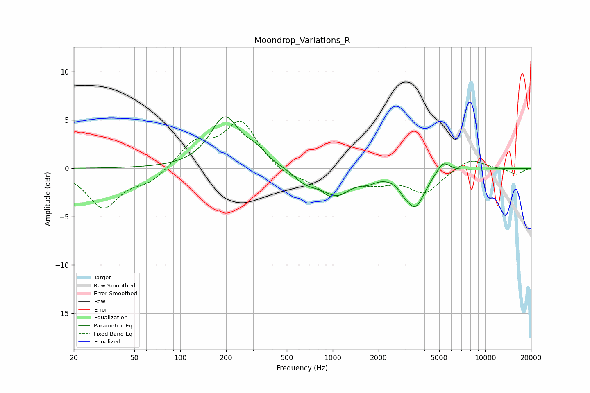

# Moondrop_Variations_R
See [usage instructions](https://github.com/jaakkopasanen/AutoEq#usage) for more options and info.

### Parametric EQs
Apply preamp of -5.4 dB when using parametric equalizer.

|   # | Type    |   Fc (Hz) |    Q |   Gain (dB) |
|-----|---------|-----------|------|-------------|
|   1 | Peaking |       196 | 1.51 |         5.2 |
|   2 | Peaking |       311 | 2.05 |         1.2 |
|   3 | Peaking |       605 | 2.88 |        -0.4 |
|   4 | Peaking |       699 | 2.14 |        -0.7 |
|   5 | Peaking |      1083 | 1.29 |        -2.8 |
|   6 | Peaking |      1283 | 1.87 |         0.4 |
|   7 | Peaking |      1715 | 2.73 |        -0.5 |
|   8 | Peaking |      2926 | 4.87 |        -0.4 |
|   9 | Peaking |      3475 | 2.19 |        -3.8 |
|  10 | Peaking |      5303 | 3.2  |         1.3 |

### Fixed Band EQs
When using fixed band (also called graphic) equalizer, apply preamp of **-5.0 dB** (if available) and set gains manually with these parameters.

|   # | Type    |   Fc (Hz) |    Q |   Gain (dB) |
|-----|---------|-----------|------|-------------|
|   1 | Peaking |        31 | 1.41 |        -4   |
|   2 | Peaking |        62 | 1.41 |        -1.3 |
|   3 | Peaking |       125 | 1.41 |         2.5 |
|   4 | Peaking |       250 | 1.41 |         4.7 |
|   5 | Peaking |       500 | 1.41 |        -0.9 |
|   6 | Peaking |      1000 | 1.41 |        -2.7 |
|   7 | Peaking |      2000 | 1.41 |        -1   |
|   8 | Peaking |      4000 | 1.41 |        -2.4 |
|   9 | Peaking |      8000 | 1.41 |         1.1 |
|  10 | Peaking |     16000 | 1.41 |        -0.6 |

### Graphs

