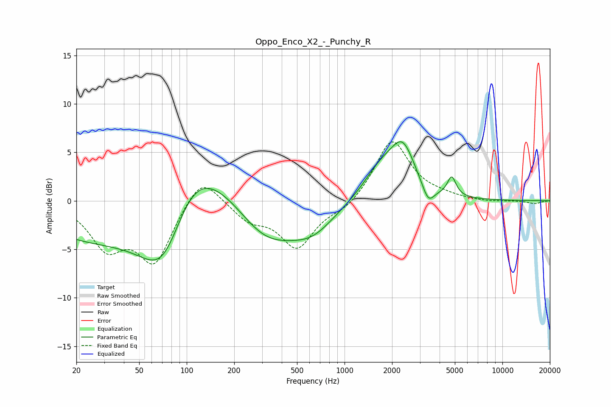

# Oppo_Enco_X2_-_Punchy_R
See [usage instructions](https://github.com/jaakkopasanen/AutoEq#usage) for more options and info.

### Parametric EQs
Apply preamp of -6.2 dB when using parametric equalizer.

|   # | Type    |   Fc (Hz) |    Q |   Gain (dB) |
|-----|---------|-----------|------|-------------|
|   1 | Peaking |        20 | 0.47 |        -2.5 |
|   2 | Peaking |        72 | 0.61 |       -15.5 |
|   3 | Peaking |       104 | 0.49 |        13.6 |
|   4 | Peaking |       294 | 0.96 |        -0.9 |
|   5 | Peaking |       330 | 0.65 |        -4.5 |
|   6 | Peaking |       629 | 1.01 |        -2.3 |
|   7 | Peaking |      1699 | 1.25 |         3.1 |
|   8 | Peaking |      2343 | 1.83 |         4.7 |
|   9 | Peaking |      3394 | 3.76 |        -1.9 |
|  10 | Peaking |      4775 | 5.19 |         2   |

### Fixed Band EQs
When using fixed band (also called graphic) equalizer, apply preamp of **-6.2 dB** (if available) and set gains manually with these parameters.

|   # | Type    |   Fc (Hz) |    Q |   Gain (dB) |
|-----|---------|-----------|------|-------------|
|   1 | Peaking |        31 | 1.41 |        -4.4 |
|   2 | Peaking |        62 | 1.41 |        -6.1 |
|   3 | Peaking |       125 | 1.41 |         3.1 |
|   4 | Peaking |       250 | 1.41 |        -1.8 |
|   5 | Peaking |       500 | 1.41 |        -4.7 |
|   6 | Peaking |      1000 | 1.41 |        -0.9 |
|   7 | Peaking |      2000 | 1.41 |         6.4 |
|   8 | Peaking |      4000 | 1.41 |         0.3 |
|   9 | Peaking |      8000 | 1.41 |        -0.1 |
|  10 | Peaking |     16000 | 1.41 |        -0.3 |

### Graphs

