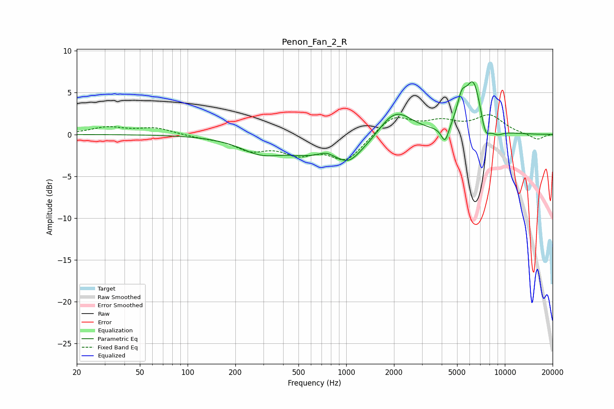

# Penon_Fan_2_R
See [usage instructions](https://github.com/jaakkopasanen/AutoEq#usage) for more options and info.

### Parametric EQs
Apply preamp of -6.4 dB when using parametric equalizer.

|   # | Type    |   Fc (Hz) |    Q |   Gain (dB) |
|-----|---------|-----------|------|-------------|
|   1 | Peaking |       286 | 1.12 |        -1.5 |
|   2 | Peaking |       747 | 2.66 |         0.8 |
|   3 | Peaking |       949 | 0.49 |        -3.3 |
|   4 | Peaking |      1048 | 2.37 |        -1   |
|   5 | Peaking |      2017 | 1.21 |         4.3 |
|   6 | Peaking |      4197 | 5.88 |        -2   |
|   7 | Peaking |      5337 | 4.83 |         2.6 |
|   8 | Peaking |      6338 | 2.67 |         6.2 |
|   9 | Peaking |      7545 | 4.7  |        -2.3 |
|  10 | Peaking |      8895 | 3.34 |        -0.7 |

### Fixed Band EQs
When using fixed band (also called graphic) equalizer, apply preamp of **-2.4 dB** (if available) and set gains manually with these parameters.

|   # | Type    |   Fc (Hz) |    Q |   Gain (dB) |
|-----|---------|-----------|------|-------------|
|   1 | Peaking |        31 | 1.41 |         0.8 |
|   2 | Peaking |        62 | 1.41 |         0.8 |
|   3 | Peaking |       125 | 1.41 |        -0.3 |
|   4 | Peaking |       250 | 1.41 |        -1.6 |
|   5 | Peaking |       500 | 1.41 |        -1.9 |
|   6 | Peaking |      1000 | 1.41 |        -3   |
|   7 | Peaking |      2000 | 1.41 |         2.3 |
|   8 | Peaking |      4000 | 1.41 |         1.3 |
|   9 | Peaking |      8000 | 1.41 |         2.1 |
|  10 | Peaking |     16000 | 1.41 |        -0.7 |

### Graphs

