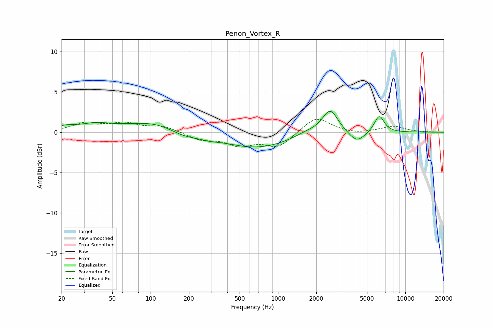

# Penon_Vortex_R
See [usage instructions](https://github.com/jaakkopasanen/AutoEq#usage) for more options and info.

### Parametric EQs
Apply preamp of -2.7 dB when using parametric equalizer.

|   # | Type    |   Fc (Hz) |    Q |   Gain (dB) |
|-----|---------|-----------|------|-------------|
|   1 | Peaking |        21 | 1.92 |         0.5 |
|   2 | Peaking |        37 | 1.15 |         0.8 |
|   3 | Peaking |       113 | 0.6  |         1.4 |
|   4 | Peaking |       180 | 1.13 |        -1   |
|   5 | Peaking |       288 | 1.9  |        -0.3 |
|   6 | Peaking |       678 | 0.52 |        -1.9 |
|   7 | Peaking |      1669 | 1.43 |         0.5 |
|   8 | Peaking |      2568 | 2.27 |         3   |
|   9 | Peaking |      4167 | 2.27 |        -1.4 |
|  10 | Peaking |      6236 | 3.52 |         2.1 |

### Fixed Band EQs
When using fixed band (also called graphic) equalizer, apply preamp of **-1.7 dB** (if available) and set gains manually with these parameters.

|   # | Type    |   Fc (Hz) |    Q |   Gain (dB) |
|-----|---------|-----------|------|-------------|
|   1 | Peaking |        31 | 1.41 |         1.1 |
|   2 | Peaking |        62 | 1.41 |         1   |
|   3 | Peaking |       125 | 1.41 |         0.7 |
|   4 | Peaking |       250 | 1.41 |        -0.9 |
|   5 | Peaking |       500 | 1.41 |        -1.5 |
|   6 | Peaking |      1000 | 1.41 |        -1.8 |
|   7 | Peaking |      2000 | 1.41 |         2   |
|   8 | Peaking |      4000 | 1.41 |        -0.2 |
|   9 | Peaking |      8000 | 1.41 |         0.7 |
|  10 | Peaking |     16000 | 1.41 |        -0   |

### Graphs

