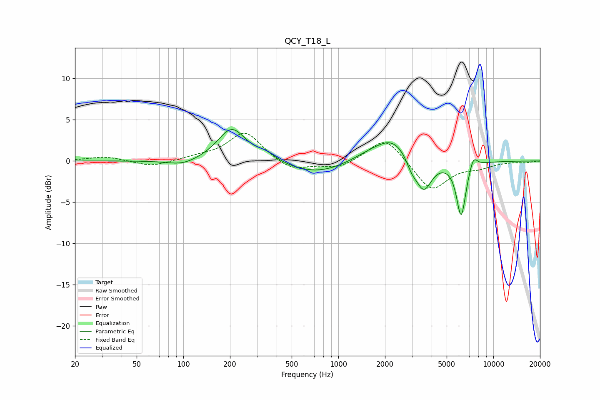

# QCY_T18_L
See [usage instructions](https://github.com/jaakkopasanen/AutoEq#usage) for more options and info.

### Parametric EQs
Apply preamp of -3.9 dB when using parametric equalizer.

|   # | Type    |   Fc (Hz) |    Q |   Gain (dB) |
|-----|---------|-----------|------|-------------|
|   1 | Peaking |        99 | 1.45 |        -0.7 |
|   2 | Peaking |       206 | 1.56 |         4   |
|   3 | Peaking |       342 | 2.38 |         0.8 |
|   4 | Peaking |       733 | 0.73 |        -1.6 |
|   5 | Peaking |      1665 | 1.03 |         1   |
|   6 | Peaking |      2273 | 1.38 |         2.4 |
|   7 | Peaking |      2976 | 4.12 |        -1.2 |
|   8 | Peaking |      3555 | 2.73 |        -3.9 |
|   9 | Peaking |      6202 | 4.52 |        -6.7 |
|  10 | Peaking |      7438 | 5.31 |         1.5 |

### Fixed Band EQs
When using fixed band (also called graphic) equalizer, apply preamp of **-3.5 dB** (if available) and set gains manually with these parameters.

|   # | Type    |   Fc (Hz) |    Q |   Gain (dB) |
|-----|---------|-----------|------|-------------|
|   1 | Peaking |        31 | 1.41 |         0.5 |
|   2 | Peaking |        62 | 1.41 |        -0.7 |
|   3 | Peaking |       125 | 1.41 |         0.4 |
|   4 | Peaking |       250 | 1.41 |         3.5 |
|   5 | Peaking |       500 | 1.41 |        -1.3 |
|   6 | Peaking |      1000 | 1.41 |        -0.9 |
|   7 | Peaking |      2000 | 1.41 |         3   |
|   8 | Peaking |      4000 | 1.41 |        -3.7 |
|   9 | Peaking |      8000 | 1.41 |        -0.6 |
|  10 | Peaking |     16000 | 1.41 |        -0.2 |

### Graphs

