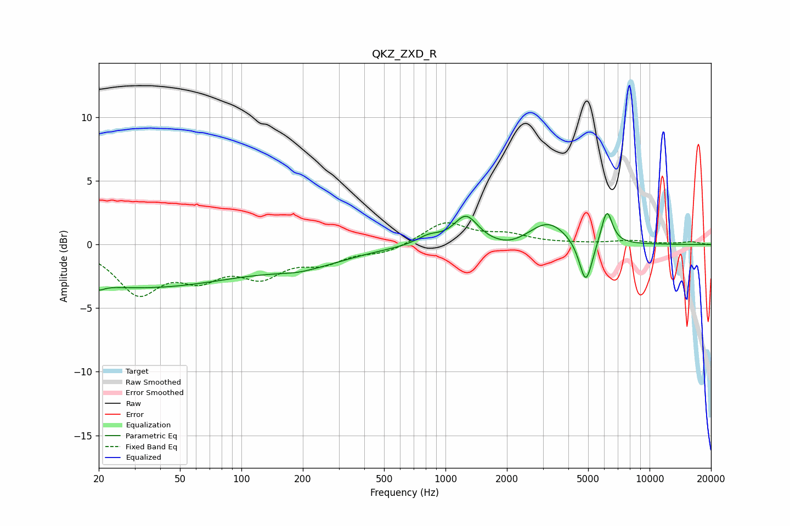

# QKZ_ZXD_R
See [usage instructions](https://github.com/jaakkopasanen/AutoEq#usage) for more options and info.

### Parametric EQs
Apply preamp of -2.5 dB when using parametric equalizer.

|   # | Type    |   Fc (Hz) |    Q |   Gain (dB) |
|-----|---------|-----------|------|-------------|
|   1 | Peaking |        20 | 5.5  |        -0.4 |
|   2 | Peaking |        30 | 0.26 |        -3.3 |
|   3 | Peaking |       188 | 2.15 |        -0.1 |
|   4 | Peaking |       211 | 0.67 |        -1.2 |
|   5 | Peaking |       827 | 2.38 |         0.6 |
|   6 | Peaking |      1260 | 2.42 |         2.2 |
|   7 | Peaking |      2054 | 1.56 |        -0.5 |
|   8 | Peaking |      3174 | 1.5  |         1.8 |
|   9 | Peaking |      4872 | 4.32 |        -3.5 |
|  10 | Peaking |      6172 | 5.02 |         2.7 |

### Fixed Band EQs
When using fixed band (also called graphic) equalizer, apply preamp of **-1.8 dB** (if available) and set gains manually with these parameters.

|   # | Type    |   Fc (Hz) |    Q |   Gain (dB) |
|-----|---------|-----------|------|-------------|
|   1 | Peaking |        31 | 1.41 |        -3.6 |
|   2 | Peaking |        62 | 1.41 |        -2.1 |
|   3 | Peaking |       125 | 1.41 |        -2.1 |
|   4 | Peaking |       250 | 1.41 |        -1.2 |
|   5 | Peaking |       500 | 1.41 |        -0.6 |
|   6 | Peaking |      1000 | 1.41 |         1.7 |
|   7 | Peaking |      2000 | 1.41 |         0.7 |
|   8 | Peaking |      4000 | 1.41 |         0.1 |
|   9 | Peaking |      8000 | 1.41 |         0.3 |
|  10 | Peaking |     16000 | 1.41 |         0.2 |

### Graphs

