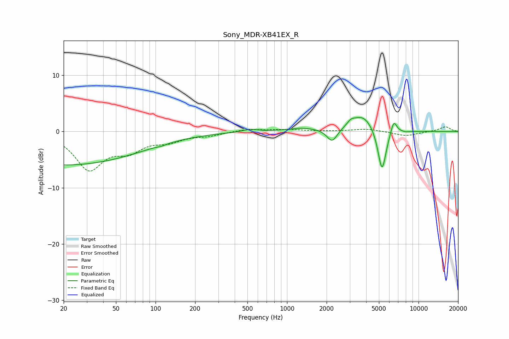

# Sony_MDR-XB41EX_R
See [usage instructions](https://github.com/jaakkopasanen/AutoEq#usage) for more options and info.

### Parametric EQs
Apply preamp of -2.6 dB when using parametric equalizer.

|   # | Type    |   Fc (Hz) |    Q |   Gain (dB) |
|-----|---------|-----------|------|-------------|
|   1 | Peaking |        20 | 0.22 |        -6   |
|   2 | Peaking |       111 | 4.9  |        -0.2 |
|   3 | Peaking |       525 | 2.57 |         0.5 |
|   4 | Peaking |      1311 | 1.3  |         0.6 |
|   5 | Peaking |      2203 | 3.65 |        -2.3 |
|   6 | Peaking |      3064 | 4.82 |         0.8 |
|   7 | Peaking |      3781 | 1.68 |         3   |
|   8 | Peaking |      5276 | 4.34 |        -7.8 |
|   9 | Peaking |      6481 | 5.84 |         2.5 |
|  10 | Peaking |      8015 | 6    |        -0.1 |

### Fixed Band EQs
When using fixed band (also called graphic) equalizer, apply preamp of **-0.9 dB** (if available) and set gains manually with these parameters.

|   # | Type    |   Fc (Hz) |    Q |   Gain (dB) |
|-----|---------|-----------|------|-------------|
|   1 | Peaking |        31 | 1.41 |        -6.5 |
|   2 | Peaking |        62 | 1.41 |        -2.8 |
|   3 | Peaking |       125 | 1.41 |        -1.4 |
|   4 | Peaking |       250 | 1.41 |        -0.6 |
|   5 | Peaking |       500 | 1.41 |         0.5 |
|   6 | Peaking |      1000 | 1.41 |         0.3 |
|   7 | Peaking |      2000 | 1.41 |         0   |
|   8 | Peaking |      4000 | 1.41 |         0.5 |
|   9 | Peaking |      8000 | 1.41 |        -0.8 |
|  10 | Peaking |     16000 | 1.41 |         0.9 |

### Graphs

