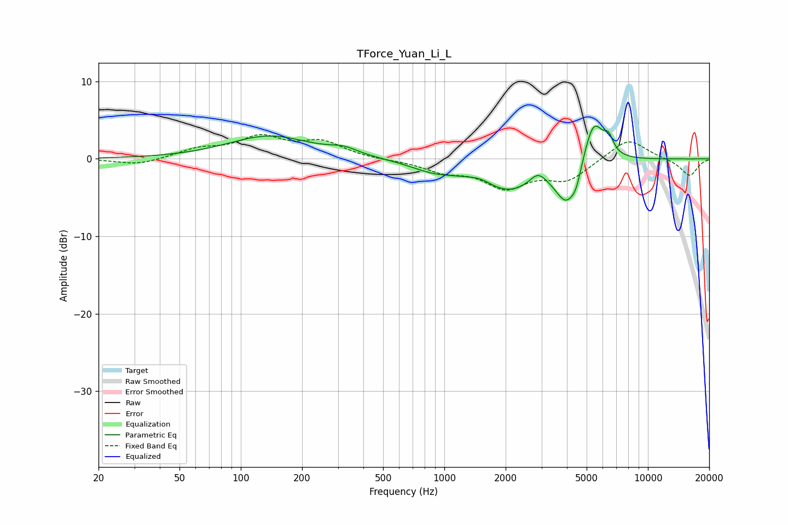

# TForce_Yuan_Li_L
See [usage instructions](https://github.com/jaakkopasanen/AutoEq#usage) for more options and info.

### Parametric EQs
Apply preamp of -4.3 dB when using parametric equalizer.

|   # | Type    |   Fc (Hz) |    Q |   Gain (dB) |
|-----|---------|-----------|------|-------------|
|   1 | Peaking |       138 | 0.7  |         2.9 |
|   2 | Peaking |       321 | 2.05 |         0.8 |
|   3 | Peaking |       886 | 1.24 |        -1.2 |
|   4 | Peaking |      1517 | 2.49 |         0.6 |
|   5 | Peaking |      2065 | 0.94 |        -4   |
|   6 | Peaking |      2883 | 3.44 |         1.6 |
|   7 | Peaking |      3995 | 2.52 |        -5.1 |
|   8 | Peaking |      4447 | 6    |        -1.6 |
|   9 | Peaking |      5404 | 2.77 |         6   |
|  10 | Peaking |      6409 | 6    |         1.8 |

### Fixed Band EQs
When using fixed band (also called graphic) equalizer, apply preamp of **-3.2 dB** (if available) and set gains manually with these parameters.

|   # | Type    |   Fc (Hz) |    Q |   Gain (dB) |
|-----|---------|-----------|------|-------------|
|   1 | Peaking |        31 | 1.41 |        -0.8 |
|   2 | Peaking |        62 | 1.41 |         1.1 |
|   3 | Peaking |       125 | 1.41 |         2.6 |
|   4 | Peaking |       250 | 1.41 |         2   |
|   5 | Peaking |       500 | 1.41 |        -0.1 |
|   6 | Peaking |      1000 | 1.41 |        -1.4 |
|   7 | Peaking |      2000 | 1.41 |        -3.4 |
|   8 | Peaking |      4000 | 1.41 |        -2.6 |
|   9 | Peaking |      8000 | 1.41 |         2.8 |
|  10 | Peaking |     16000 | 1.41 |        -2.2 |

### Graphs

