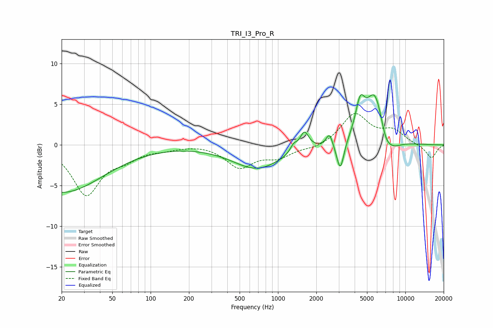

# TRI_I3_Pro_R
See [usage instructions](https://github.com/jaakkopasanen/AutoEq#usage) for more options and info.

### Parametric EQs
Apply preamp of -6.3 dB when using parametric equalizer.

|   # | Type    |   Fc (Hz) |    Q |   Gain (dB) |
|-----|---------|-----------|------|-------------|
|   1 | Peaking |        20 | 0.43 |        -5.8 |
|   2 | Peaking |       683 | 0.73 |        -2.9 |
|   3 | Peaking |      1328 | 5.26 |         0.9 |
|   4 | Peaking |      1612 | 4.1  |         2.2 |
|   5 | Peaking |      2536 | 5.73 |         1.6 |
|   6 | Peaking |      3084 | 4.93 |        -3.7 |
|   7 | Peaking |      4419 | 3.81 |         3.9 |
|   8 | Peaking |      5772 | 1.97 |         6.4 |
|   9 | Peaking |      6982 | 3.2  |        -1.8 |
|  10 | Peaking |      7929 | 1.97 |        -1.3 |

### Fixed Band EQs
When using fixed band (also called graphic) equalizer, apply preamp of **-4.0 dB** (if available) and set gains manually with these parameters.

|   # | Type    |   Fc (Hz) |    Q |   Gain (dB) |
|-----|---------|-----------|------|-------------|
|   1 | Peaking |        31 | 1.41 |        -6   |
|   2 | Peaking |        62 | 1.41 |        -1.3 |
|   3 | Peaking |       125 | 1.41 |        -0.4 |
|   4 | Peaking |       250 | 1.41 |         0.1 |
|   5 | Peaking |       500 | 1.41 |        -2.7 |
|   6 | Peaking |      1000 | 1.41 |        -1.4 |
|   7 | Peaking |      2000 | 1.41 |        -0.5 |
|   8 | Peaking |      4000 | 1.41 |         3.8 |
|   9 | Peaking |      8000 | 1.41 |         1.6 |
|  10 | Peaking |     16000 | 1.41 |        -1.7 |

### Graphs

