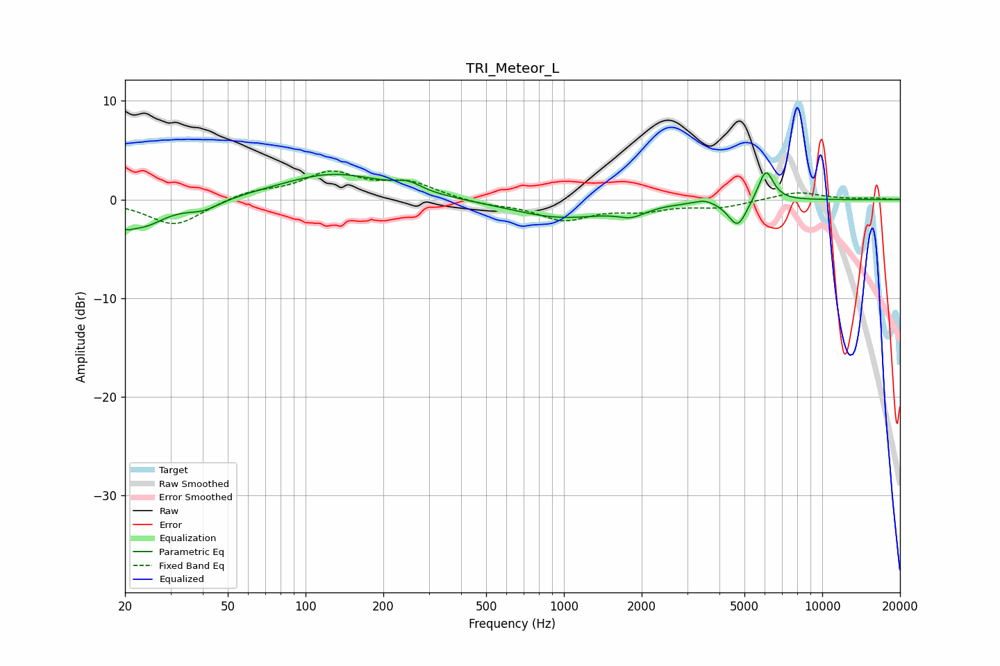

# TRI_Meteor_L
See [usage instructions](https://github.com/jaakkopasanen/AutoEq#usage) for more options and info.

### Parametric EQs
Apply preamp of -2.8 dB when using parametric equalizer.

|   # | Type    |   Fc (Hz) |    Q |   Gain (dB) |
|-----|---------|-----------|------|-------------|
|   1 | Peaking |        20 | 5.19 |        -0.9 |
|   2 | Peaking |        23 | 1.58 |        -2.6 |
|   3 | Peaking |        40 | 2.06 |        -1   |
|   4 | Peaking |       128 | 0.71 |         2.6 |
|   5 | Peaking |       249 | 2.69 |         0.8 |
|   6 | Peaking |       973 | 0.73 |        -1.8 |
|   7 | Peaking |      1830 | 2.57 |        -0.9 |
|   8 | Peaking |      3503 | 3.82 |         0.4 |
|   9 | Peaking |      4703 | 3.86 |        -2.7 |
|  10 | Peaking |      6049 | 4.62 |         3.3 |

### Fixed Band EQs
When using fixed band (also called graphic) equalizer, apply preamp of **-3.0 dB** (if available) and set gains manually with these parameters.

|   # | Type    |   Fc (Hz) |    Q |   Gain (dB) |
|-----|---------|-----------|------|-------------|
|   1 | Peaking |        31 | 1.41 |        -2.7 |
|   2 | Peaking |        62 | 1.41 |         0.8 |
|   3 | Peaking |       125 | 1.41 |         2.6 |
|   4 | Peaking |       250 | 1.41 |         1.6 |
|   5 | Peaking |       500 | 1.41 |        -0.5 |
|   6 | Peaking |      1000 | 1.41 |        -2   |
|   7 | Peaking |      2000 | 1.41 |        -0.9 |
|   8 | Peaking |      4000 | 1.41 |        -0.7 |
|   9 | Peaking |      8000 | 1.41 |         0.8 |
|  10 | Peaking |     16000 | 1.41 |         0.1 |

### Graphs

