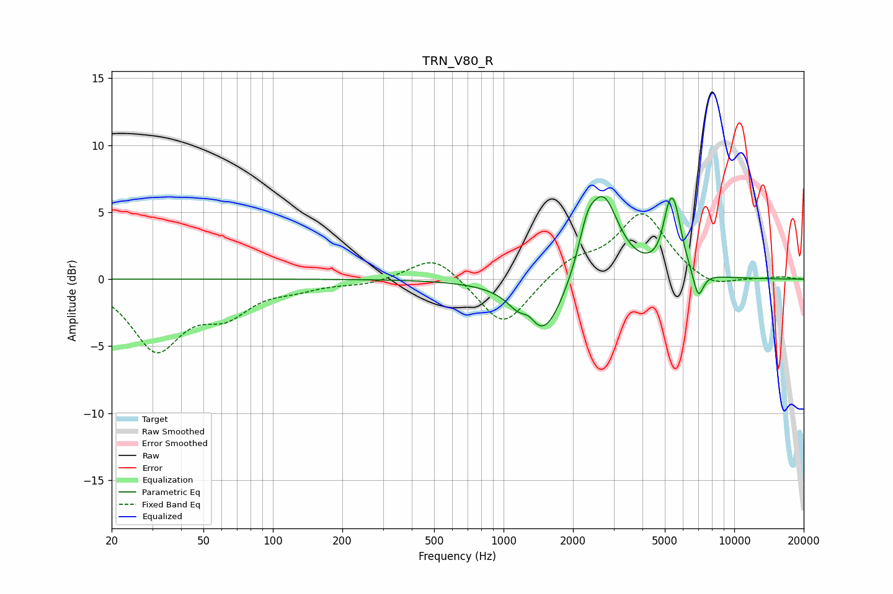

# TRN_V80_R
See [usage instructions](https://github.com/jaakkopasanen/AutoEq#usage) for more options and info.

### Parametric EQs
Apply preamp of -6.3 dB when using parametric equalizer.

|   # | Type    |   Fc (Hz) |    Q |   Gain (dB) |
|-----|---------|-----------|------|-------------|
|   1 | Peaking |      1096 | 1.77 |         0.4 |
|   2 | Peaking |      1169 | 2.82 |        -0.7 |
|   3 | Peaking |      1284 | 4.16 |         0.9 |
|   4 | Peaking |      1472 | 1.51 |        -4.7 |
|   5 | Peaking |      2304 | 3.76 |         2.4 |
|   6 | Peaking |      2716 | 2.06 |         6   |
|   7 | Peaking |      5106 | 5.99 |         0.8 |
|   8 | Peaking |      5198 | 5.99 |         1.1 |
|   9 | Peaking |      5494 | 4.19 |         4.5 |
|  10 | Peaking |      6980 | 5.98 |        -2.1 |

### Fixed Band EQs
When using fixed band (also called graphic) equalizer, apply preamp of **-5.0 dB** (if available) and set gains manually with these parameters.

|   # | Type    |   Fc (Hz) |    Q |   Gain (dB) |
|-----|---------|-----------|------|-------------|
|   1 | Peaking |        31 | 1.41 |        -5.1 |
|   2 | Peaking |        62 | 1.41 |        -2.2 |
|   3 | Peaking |       125 | 1.41 |        -0.5 |
|   4 | Peaking |       250 | 1.41 |        -0.4 |
|   5 | Peaking |       500 | 1.41 |         1.9 |
|   6 | Peaking |      1000 | 1.41 |        -3.7 |
|   7 | Peaking |      2000 | 1.41 |         1.4 |
|   8 | Peaking |      4000 | 1.41 |         4.9 |
|   9 | Peaking |      8000 | 1.41 |        -0.8 |
|  10 | Peaking |     16000 | 1.41 |         0.2 |

### Graphs

