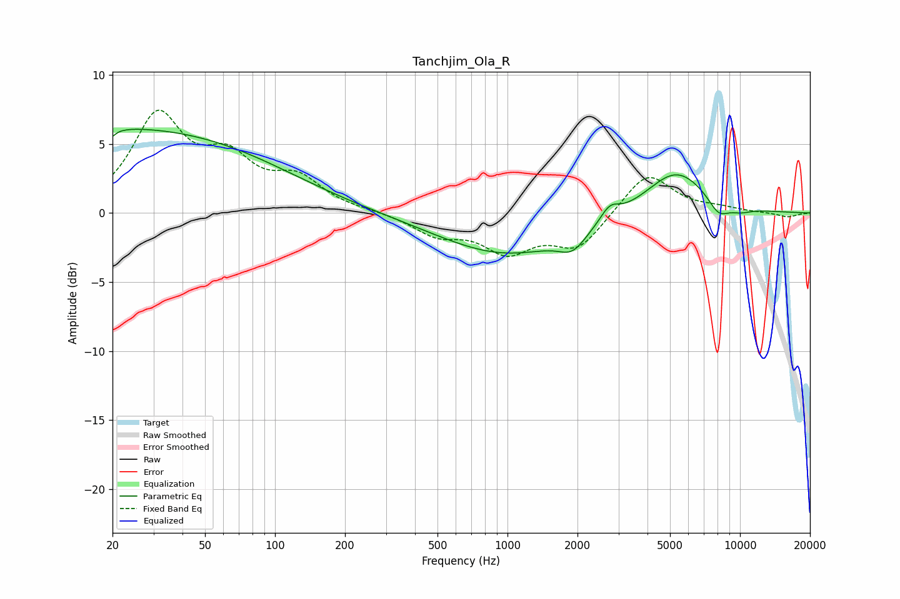

# Tanchjim_Ola_R
See [usage instructions](https://github.com/jaakkopasanen/AutoEq#usage) for more options and info.

### Parametric EQs
Apply preamp of -6.2 dB when using parametric equalizer.

|   # | Type    |   Fc (Hz) |    Q |   Gain (dB) |
|-----|---------|-----------|------|-------------|
|   1 | Peaking |        20 | 0.19 |         5.3 |
|   2 | Peaking |        20 | 5.98 |        -3.8 |
|   3 | Peaking |        20 | 5.99 |         3.2 |
|   4 | Peaking |        27 | 0.18 |         0.9 |
|   5 | Peaking |       991 | 0.49 |        -3   |
|   6 | Peaking |      1905 | 2.43 |        -1.3 |
|   7 | Peaking |      2750 | 3.47 |         1.1 |
|   8 | Peaking |      5303 | 1.04 |         3.3 |
|   9 | Peaking |      8082 | 2.89 |        -1.2 |
|  10 | Peaking |     10000 | 2.36 |        -0.4 |

### Fixed Band EQs
When using fixed band (also called graphic) equalizer, apply preamp of **-7.5 dB** (if available) and set gains manually with these parameters.

|   # | Type    |   Fc (Hz) |    Q |   Gain (dB) |
|-----|---------|-----------|------|-------------|
|   1 | Peaking |        31 | 1.41 |         6.8 |
|   2 | Peaking |        62 | 1.41 |         3.3 |
|   3 | Peaking |       125 | 1.41 |         2.2 |
|   4 | Peaking |       250 | 1.41 |         0.1 |
|   5 | Peaking |       500 | 1.41 |        -1.5 |
|   6 | Peaking |      1000 | 1.41 |        -2.6 |
|   7 | Peaking |      2000 | 1.41 |        -2.5 |
|   8 | Peaking |      4000 | 1.41 |         3   |
|   9 | Peaking |      8000 | 1.41 |         0.3 |
|  10 | Peaking |     16000 | 1.41 |        -0.3 |

### Graphs

