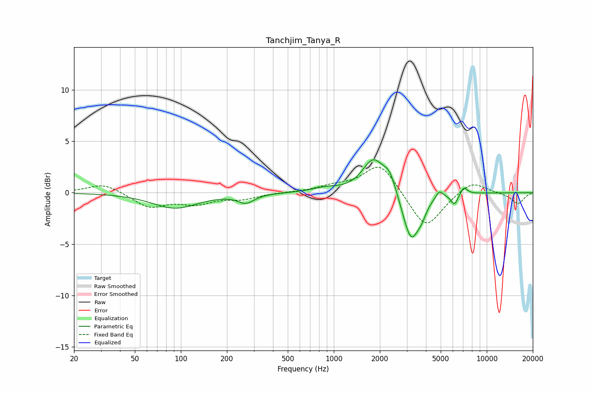

# Tanchjim_Tanya_R
See [usage instructions](https://github.com/jaakkopasanen/AutoEq#usage) for more options and info.

### Parametric EQs
Apply preamp of -3.3 dB when using parametric equalizer.

|   # | Type    |   Fc (Hz) |    Q |   Gain (dB) |
|-----|---------|-----------|------|-------------|
|   1 | Peaking |        92 | 0.95 |        -1.5 |
|   2 | Peaking |       267 | 2.68 |        -0.9 |
|   3 | Peaking |       873 | 1.7  |         0.4 |
|   4 | Peaking |      1812 | 1.98 |         3.2 |
|   5 | Peaking |      2320 | 3.44 |         1.6 |
|   6 | Peaking |      3203 | 2.59 |        -4.8 |
|   7 | Peaking |      3767 | 5.19 |        -0.8 |
|   8 | Peaking |      4896 | 5.85 |         0.8 |
|   9 | Peaking |      6148 | 6    |        -1.1 |
|  10 | Peaking |      7083 | 6    |         0.7 |

### Fixed Band EQs
When using fixed band (also called graphic) equalizer, apply preamp of **-2.6 dB** (if available) and set gains manually with these parameters.

|   # | Type    |   Fc (Hz) |    Q |   Gain (dB) |
|-----|---------|-----------|------|-------------|
|   1 | Peaking |        31 | 1.41 |         0.9 |
|   2 | Peaking |        62 | 1.41 |        -1.4 |
|   3 | Peaking |       125 | 1.41 |        -0.9 |
|   4 | Peaking |       250 | 1.41 |        -0.5 |
|   5 | Peaking |       500 | 1.41 |         0   |
|   6 | Peaking |      1000 | 1.41 |         0.5 |
|   7 | Peaking |      2000 | 1.41 |         2.9 |
|   8 | Peaking |      4000 | 1.41 |        -3.6 |
|   9 | Peaking |      8000 | 1.41 |         1.2 |
|  10 | Peaking |     16000 | 1.41 |        -1.1 |

### Graphs

