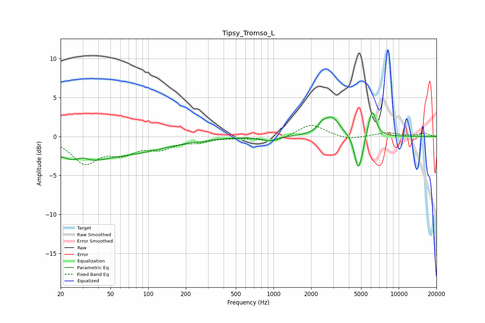

# Tipsy_Tromso_L
See [usage instructions](https://github.com/jaakkopasanen/AutoEq#usage) for more options and info.

### Parametric EQs
Apply preamp of -3.1 dB when using parametric equalizer.

|   # | Type    |   Fc (Hz) |    Q |   Gain (dB) |
|-----|---------|-----------|------|-------------|
|   1 | Peaking |        28 | 0.69 |        -2.8 |
|   2 | Peaking |        30 | 3.1  |         0.6 |
|   3 | Peaking |        82 | 0.49 |        -1.6 |
|   4 | Peaking |       273 | 3.9  |        -0.1 |
|   5 | Peaking |       920 | 2.55 |        -0.5 |
|   6 | Peaking |      2423 | 5.48 |         0.6 |
|   7 | Peaking |      2895 | 2.19 |         2.5 |
|   8 | Peaking |      4715 | 4.91 |        -4.1 |
|   9 | Peaking |      5058 | 6    |        -1   |
|  10 | Peaking |      6128 | 4.49 |         3.5 |

### Fixed Band EQs
When using fixed band (also called graphic) equalizer, apply preamp of **-1.5 dB** (if available) and set gains manually with these parameters.

|   # | Type    |   Fc (Hz) |    Q |   Gain (dB) |
|-----|---------|-----------|------|-------------|
|   1 | Peaking |        31 | 1.41 |        -3.2 |
|   2 | Peaking |        62 | 1.41 |        -1.8 |
|   3 | Peaking |       125 | 1.41 |        -1.3 |
|   4 | Peaking |       250 | 1.41 |        -0.5 |
|   5 | Peaking |       500 | 1.41 |        -0   |
|   6 | Peaking |      1000 | 1.41 |        -0.7 |
|   7 | Peaking |      2000 | 1.41 |         1.6 |
|   8 | Peaking |      4000 | 1.41 |        -0.5 |
|   9 | Peaking |      8000 | 1.41 |         0.5 |
|  10 | Peaking |     16000 | 1.41 |         0.4 |

### Graphs

