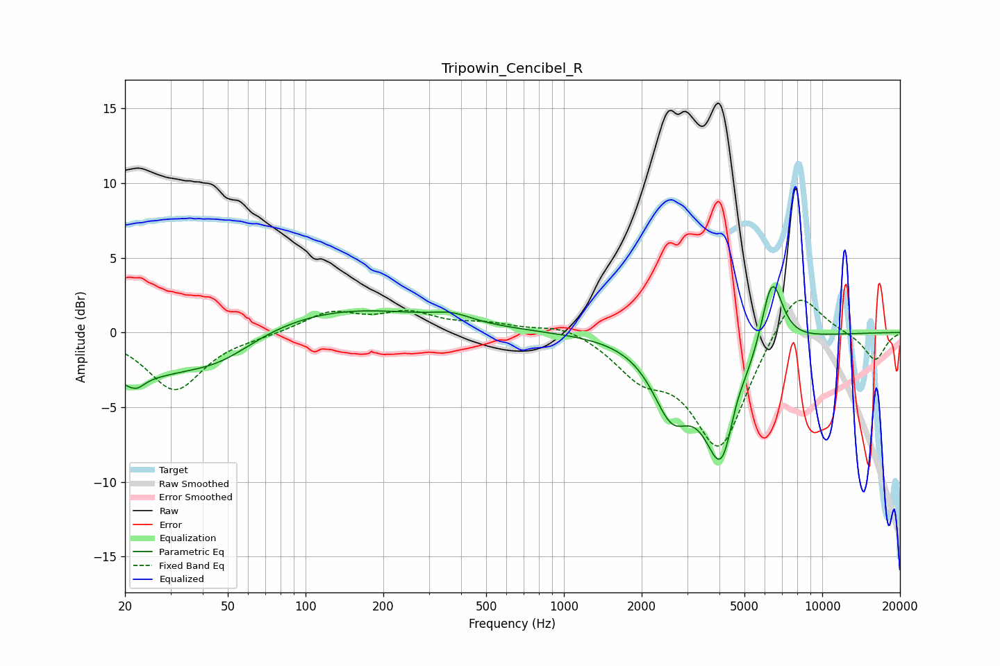

# Tripowin_Cencibel_R
See [usage instructions](https://github.com/jaakkopasanen/AutoEq#usage) for more options and info.

### Parametric EQs
Apply preamp of -3.2 dB when using parametric equalizer.

|   # | Type    |   Fc (Hz) |    Q |   Gain (dB) |
|-----|---------|-----------|------|-------------|
|   1 | Peaking |        20 | 0.45 |        -3.1 |
|   2 | Peaking |        22 | 6    |         2.9 |
|   3 | Peaking |        22 | 5.55 |        -3.6 |
|   4 | Peaking |        47 | 1.08 |        -1.1 |
|   5 | Peaking |       131 | 0.4  |         1.8 |
|   6 | Peaking |       368 | 1.87 |         0.5 |
|   7 | Peaking |      2610 | 1.89 |        -4.3 |
|   8 | Peaking |      4130 | 1.99 |        -9.1 |
|   9 | Peaking |      4572 | 3.35 |         2.1 |
|  10 | Peaking |      6388 | 3.25 |         5   |

### Fixed Band EQs
When using fixed band (also called graphic) equalizer, apply preamp of **-2.3 dB** (if available) and set gains manually with these parameters.

|   # | Type    |   Fc (Hz) |    Q |   Gain (dB) |
|-----|---------|-----------|------|-------------|
|   1 | Peaking |        31 | 1.41 |        -3.8 |
|   2 | Peaking |        62 | 1.41 |        -0.2 |
|   3 | Peaking |       125 | 1.41 |         1.3 |
|   4 | Peaking |       250 | 1.41 |         1.2 |
|   5 | Peaking |       500 | 1.41 |         0.5 |
|   6 | Peaking |      1000 | 1.41 |         0.6 |
|   7 | Peaking |      2000 | 1.41 |        -2.4 |
|   8 | Peaking |      4000 | 1.41 |        -7.7 |
|   9 | Peaking |      8000 | 1.41 |         3.4 |
|  10 | Peaking |     16000 | 1.41 |        -1.9 |

### Graphs

