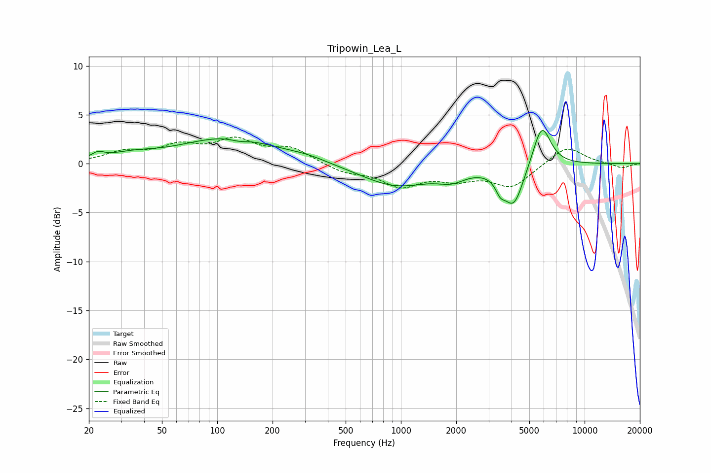

# Tripowin_Lea_L
See [usage instructions](https://github.com/jaakkopasanen/AutoEq#usage) for more options and info.

### Parametric EQs
Apply preamp of -3.5 dB when using parametric equalizer.

|   # | Type    |   Fc (Hz) |    Q |   Gain (dB) |
|-----|---------|-----------|------|-------------|
|   1 | Peaking |        22 | 4.26 |         0.6 |
|   2 | Peaking |        34 | 1.08 |         0.6 |
|   3 | Peaking |       115 | 0.55 |         2.6 |
|   4 | Peaking |       132 | 2.99 |        -0.3 |
|   5 | Peaking |       309 | 1.28 |         0.4 |
|   6 | Peaking |       940 | 0.74 |        -2.3 |
|   7 | Peaking |      1889 | 1.88 |        -1   |
|   8 | Peaking |      3473 | 5.57 |        -1.1 |
|   9 | Peaking |      4110 | 2.55 |        -4.2 |
|  10 | Peaking |      5844 | 2.83 |         4.4 |

### Fixed Band EQs
When using fixed band (also called graphic) equalizer, apply preamp of **-2.8 dB** (if available) and set gains manually with these parameters.

|   # | Type    |   Fc (Hz) |    Q |   Gain (dB) |
|-----|---------|-----------|------|-------------|
|   1 | Peaking |        31 | 1.41 |         1.1 |
|   2 | Peaking |        62 | 1.41 |         1.6 |
|   3 | Peaking |       125 | 1.41 |         2.2 |
|   4 | Peaking |       250 | 1.41 |         1.5 |
|   5 | Peaking |       500 | 1.41 |        -0.8 |
|   6 | Peaking |      1000 | 1.41 |        -2.1 |
|   7 | Peaking |      2000 | 1.41 |        -1.3 |
|   8 | Peaking |      4000 | 1.41 |        -2.3 |
|   9 | Peaking |      8000 | 1.41 |         1.9 |
|  10 | Peaking |     16000 | 1.41 |        -0.5 |

### Graphs

