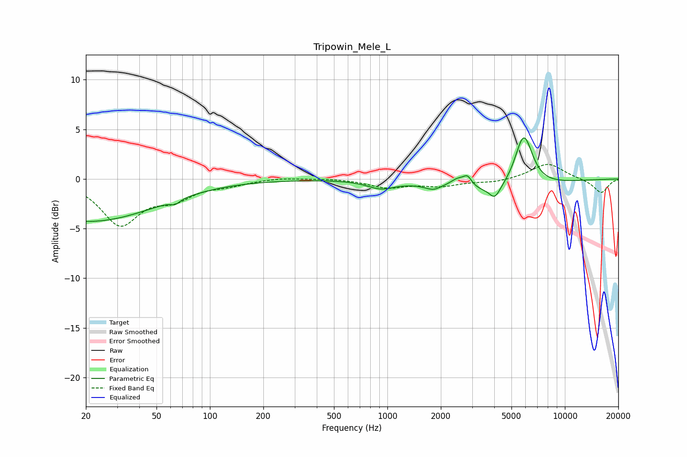

# Tripowin_Mele_L
See [usage instructions](https://github.com/jaakkopasanen/AutoEq#usage) for more options and info.

### Parametric EQs
Apply preamp of -4.2 dB when using parametric equalizer.

|   # | Type    |   Fc (Hz) |    Q |   Gain (dB) |
|-----|---------|-----------|------|-------------|
|   1 | Peaking |        21 | 0.36 |        -4.3 |
|   2 | Peaking |        64 | 5.56 |        -0.4 |
|   3 | Peaking |       919 | 1.84 |        -0.8 |
|   4 | Peaking |      1889 | 2.83 |        -1.1 |
|   5 | Peaking |      1958 | 3.3  |         0.6 |
|   6 | Peaking |      2496 | 3.11 |         0.9 |
|   7 | Peaking |      2830 | 6    |         0.9 |
|   8 | Peaking |      4031 | 4.71 |        -1.2 |
|   9 | Peaking |      4232 | 0.62 |        -1.6 |
|  10 | Peaking |      5862 | 2.71 |         5.5 |

### Fixed Band EQs
When using fixed band (also called graphic) equalizer, apply preamp of **-1.6 dB** (if available) and set gains manually with these parameters.

|   # | Type    |   Fc (Hz) |    Q |   Gain (dB) |
|-----|---------|-----------|------|-------------|
|   1 | Peaking |        31 | 1.41 |        -4.4 |
|   2 | Peaking |        62 | 1.41 |        -1.7 |
|   3 | Peaking |       125 | 1.41 |        -0.5 |
|   4 | Peaking |       250 | 1.41 |         0.2 |
|   5 | Peaking |       500 | 1.41 |         0.1 |
|   6 | Peaking |      1000 | 1.41 |        -0.8 |
|   7 | Peaking |      2000 | 1.41 |        -0.6 |
|   8 | Peaking |      4000 | 1.41 |        -0.3 |
|   9 | Peaking |      8000 | 1.41 |         1.6 |
|  10 | Peaking |     16000 | 1.41 |        -1.4 |

### Graphs

