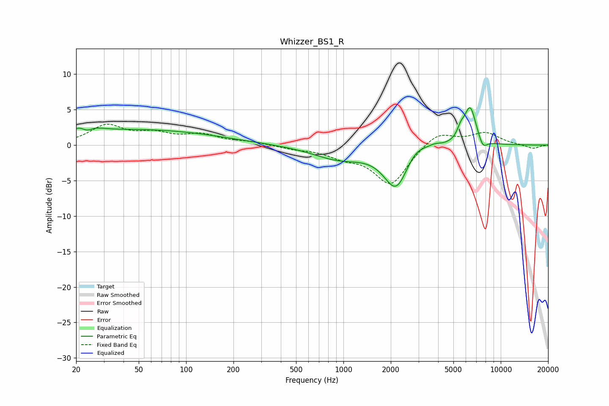

# Whizzer_BS1_R
See [usage instructions](https://github.com/jaakkopasanen/AutoEq#usage) for more options and info.

### Parametric EQs
Apply preamp of -5.4 dB when using parametric equalizer.

|   # | Type    |   Fc (Hz) |    Q |   Gain (dB) |
|-----|---------|-----------|------|-------------|
|   1 | Peaking |        23 | 2.15 |         2   |
|   2 | Peaking |        23 | 3.72 |        -1.5 |
|   3 | Peaking |        53 | 0.29 |         2.1 |
|   4 | Peaking |       937 | 0.84 |        -1.9 |
|   5 | Peaking |      2167 | 1.8  |        -6   |
|   6 | Peaking |      2859 | 2.06 |         1.6 |
|   7 | Peaking |      3814 | 3.46 |         0.4 |
|   8 | Peaking |      5576 | 6    |         1.3 |
|   9 | Peaking |      6391 | 3.56 |         5.4 |
|  10 | Peaking |      7700 | 5.01 |        -1.4 |

### Fixed Band EQs
When using fixed band (also called graphic) equalizer, apply preamp of **-3.0 dB** (if available) and set gains manually with these parameters.

|   # | Type    |   Fc (Hz) |    Q |   Gain (dB) |
|-----|---------|-----------|------|-------------|
|   1 | Peaking |        31 | 1.41 |         2.6 |
|   2 | Peaking |        62 | 1.41 |         1.4 |
|   3 | Peaking |       125 | 1.41 |         1.3 |
|   4 | Peaking |       250 | 1.41 |         0.4 |
|   5 | Peaking |       500 | 1.41 |        -0.4 |
|   6 | Peaking |      1000 | 1.41 |        -1.3 |
|   7 | Peaking |      2000 | 1.41 |        -5.5 |
|   8 | Peaking |      4000 | 1.41 |         2   |
|   9 | Peaking |      8000 | 1.41 |         1.7 |
|  10 | Peaking |     16000 | 1.41 |        -0.5 |

### Graphs

