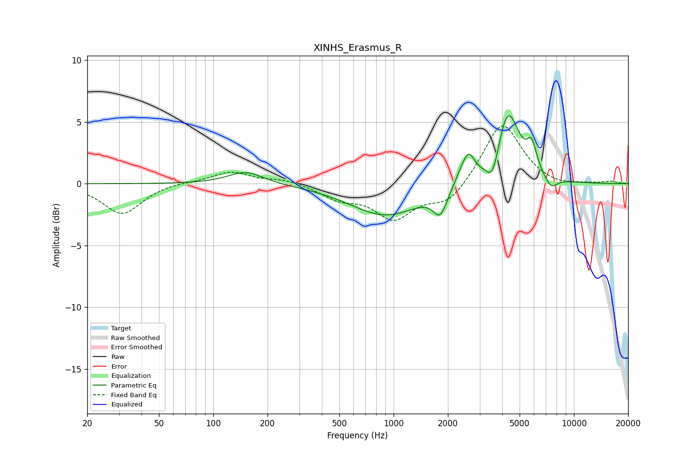

# XINHS_Erasmus_R
See [usage instructions](https://github.com/jaakkopasanen/AutoEq#usage) for more options and info.

### Parametric EQs
Apply preamp of -5.6 dB when using parametric equalizer.

|   # | Type    |   Fc (Hz) |    Q |   Gain (dB) |
|-----|---------|-----------|------|-------------|
|   1 | Peaking |       151 | 1.44 |         1   |
|   2 | Peaking |       905 | 0.72 |        -2.6 |
|   3 | Peaking |      1812 | 3.86 |        -1.5 |
|   4 | Peaking |      1833 | 3.18 |        -0.4 |
|   5 | Peaking |      2365 | 3.16 |         0.7 |
|   6 | Peaking |      2607 | 4.08 |         2   |
|   7 | Peaking |      3555 | 4.06 |        -2.2 |
|   8 | Peaking |      4296 | 2.16 |         6.1 |
|   9 | Peaking |      5833 | 5.16 |         2.1 |
|  10 | Peaking |      7461 | 3.89 |        -0.9 |

### Fixed Band EQs
When using fixed band (also called graphic) equalizer, apply preamp of **-4.8 dB** (if available) and set gains manually with these parameters.

|   # | Type    |   Fc (Hz) |    Q |   Gain (dB) |
|-----|---------|-----------|------|-------------|
|   1 | Peaking |        31 | 1.41 |        -2.5 |
|   2 | Peaking |        62 | 1.41 |         0.2 |
|   3 | Peaking |       125 | 1.41 |         1   |
|   4 | Peaking |       250 | 1.41 |         0.4 |
|   5 | Peaking |       500 | 1.41 |        -1.1 |
|   6 | Peaking |      1000 | 1.41 |        -2.7 |
|   7 | Peaking |      2000 | 1.41 |        -1.6 |
|   8 | Peaking |      4000 | 1.41 |         5.1 |
|   9 | Peaking |      8000 | 1.41 |        -0.3 |
|  10 | Peaking |     16000 | 1.41 |         0.2 |

### Graphs

