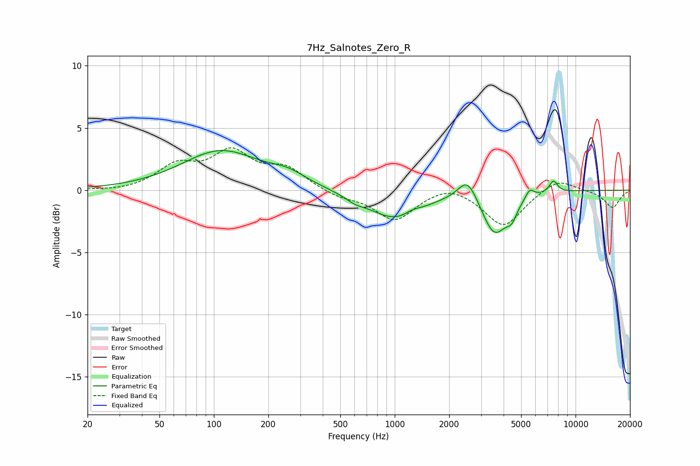

# 7Hz_Salnotes_Zero_R
See [usage instructions](https://github.com/jaakkopasanen/AutoEq#usage) for more options and info.

### Parametric EQs
Apply preamp of -3.3 dB when using parametric equalizer.

|   # | Type    |   Fc (Hz) |    Q |   Gain (dB) |
|-----|---------|-----------|------|-------------|
|   1 | Peaking |       109 | 0.66 |         3.1 |
|   2 | Peaking |       257 | 1.4  |         0.8 |
|   3 | Peaking |       601 | 2.86 |        -0.4 |
|   4 | Peaking |      1001 | 0.95 |        -2.3 |
|   5 | Peaking |      1255 | 3.5  |         0.3 |
|   6 | Peaking |      2531 | 2.66 |         1.9 |
|   7 | Peaking |      3565 | 2.05 |        -3.4 |
|   8 | Peaking |      4438 | 4.77 |        -1.1 |
|   9 | Peaking |      5576 | 6    |         0.7 |
|  10 | Peaking |      7547 | 6    |         0.9 |

### Fixed Band EQs
When using fixed band (also called graphic) equalizer, apply preamp of **-3.5 dB** (if available) and set gains manually with these parameters.

|   # | Type    |   Fc (Hz) |    Q |   Gain (dB) |
|-----|---------|-----------|------|-------------|
|   1 | Peaking |        31 | 1.41 |        -0.1 |
|   2 | Peaking |        62 | 1.41 |         1.8 |
|   3 | Peaking |       125 | 1.41 |         2.8 |
|   4 | Peaking |       250 | 1.41 |         1.6 |
|   5 | Peaking |       500 | 1.41 |        -0.5 |
|   6 | Peaking |      1000 | 1.41 |        -2.4 |
|   7 | Peaking |      2000 | 1.41 |         0.6 |
|   8 | Peaking |      4000 | 1.41 |        -2.9 |
|   9 | Peaking |      8000 | 1.41 |         1   |
|  10 | Peaking |     16000 | 1.41 |        -1.4 |

### Graphs

