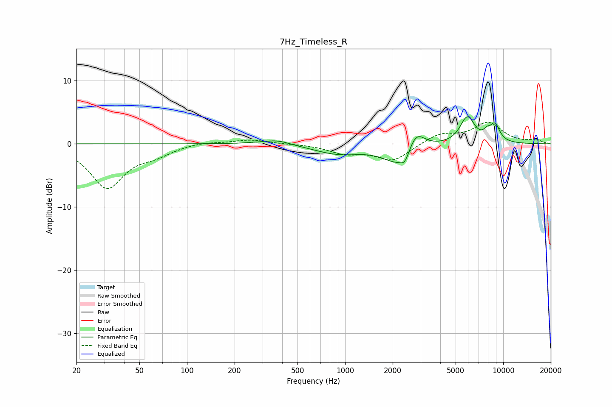

# 7Hz_Timeless_R
See [usage instructions](https://github.com/jaakkopasanen/AutoEq#usage) for more options and info.

### Parametric EQs
Apply preamp of -4.4 dB when using parametric equalizer.

|   # | Type    |   Fc (Hz) |    Q |   Gain (dB) |
|-----|---------|-----------|------|-------------|
|   1 | Peaking |       349 | 1.24 |         0.6 |
|   2 | Peaking |       384 | 2.46 |         0.3 |
|   3 | Peaking |       905 | 0.91 |        -1.5 |
|   4 | Peaking |      2187 | 1.5  |        -3.2 |
|   5 | Peaking |      2387 | 5.61 |        -1.4 |
|   6 | Peaking |      2812 | 2.62 |         3.2 |
|   7 | Peaking |      5935 | 5.38 |        -0.5 |
|   8 | Peaking |      5935 | 3.18 |         4.7 |
|   9 | Peaking |      7892 | 6    |         0.9 |
|  10 | Peaking |      8863 | 4.05 |         2.7 |

### Fixed Band EQs
When using fixed band (also called graphic) equalizer, apply preamp of **-3.5 dB** (if available) and set gains manually with these parameters.

|   # | Type    |   Fc (Hz) |    Q |   Gain (dB) |
|-----|---------|-----------|------|-------------|
|   1 | Peaking |        31 | 1.41 |        -6.9 |
|   2 | Peaking |        62 | 1.41 |        -1.4 |
|   3 | Peaking |       125 | 1.41 |         0.4 |
|   4 | Peaking |       250 | 1.41 |         0.7 |
|   5 | Peaking |       500 | 1.41 |         0   |
|   6 | Peaking |      1000 | 1.41 |        -1.3 |
|   7 | Peaking |      2000 | 1.41 |        -2.6 |
|   8 | Peaking |      4000 | 1.41 |         1.6 |
|   9 | Peaking |      8000 | 1.41 |         3.2 |
|  10 | Peaking |     16000 | 1.41 |         0.6 |

### Graphs

