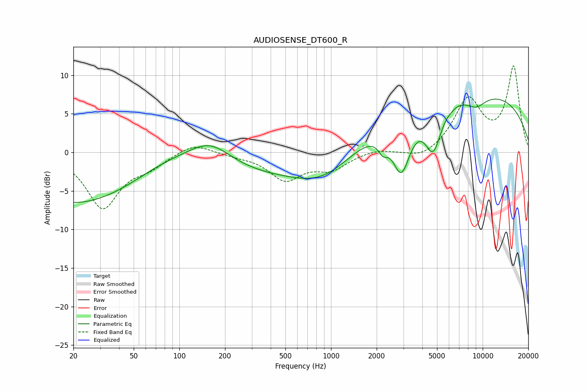

# AUDIOSENSE_DT600_R
See [usage instructions](https://github.com/jaakkopasanen/AutoEq#usage) for more options and info.

### Parametric EQs
Apply preamp of -7.0 dB when using parametric equalizer.

|   # | Type    |   Fc (Hz) |    Q |   Gain (dB) |
|-----|---------|-----------|------|-------------|
|   1 | Peaking |        59 | 0.18 |       -14.1 |
|   2 | Peaking |        85 | 0.33 |        11.6 |
|   3 | Peaking |       160 | 0.98 |         3.1 |
|   4 | Peaking |       916 | 0.65 |        -4.1 |
|   5 | Peaking |      2200 | 4.57 |        -1.6 |
|   6 | Peaking |      2913 | 2.32 |        -7.3 |
|   7 | Peaking |      4720 | 2.55 |        -6   |
|   8 | Peaking |      6232 | 5.98 |        -0.1 |
|   9 | Peaking |      7479 | 0.18 |         8.1 |
|  10 | Peaking |      9058 | 1.87 |        -1.6 |

### Fixed Band EQs
When using fixed band (also called graphic) equalizer, apply preamp of **-11.3 dB** (if available) and set gains manually with these parameters.

|   # | Type    |   Fc (Hz) |    Q |   Gain (dB) |
|-----|---------|-----------|------|-------------|
|   1 | Peaking |        31 | 1.41 |        -7.1 |
|   2 | Peaking |        62 | 1.41 |        -1.5 |
|   3 | Peaking |       125 | 1.41 |         1.4 |
|   4 | Peaking |       250 | 1.41 |        -0.3 |
|   5 | Peaking |       500 | 1.41 |        -3.4 |
|   6 | Peaking |      1000 | 1.41 |        -2   |
|   7 | Peaking |      2000 | 1.41 |         0.5 |
|   8 | Peaking |      4000 | 1.41 |        -1.1 |
|   9 | Peaking |      8000 | 1.41 |         6.7 |
|  10 | Peaking |     16000 | 1.41 |        10.9 |

### Graphs

