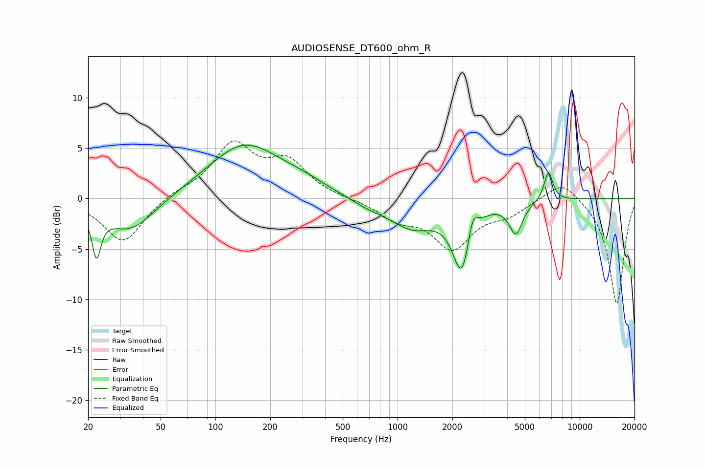

# AUDIOSENSE_DT600_ohm_R
See [usage instructions](https://github.com/jaakkopasanen/AutoEq#usage) for more options and info.

### Parametric EQs
Apply preamp of -5.4 dB when using parametric equalizer.

|   # | Type    |   Fc (Hz) |    Q |   Gain (dB) |
|-----|---------|-----------|------|-------------|
|   1 | Peaking |        22 | 5.89 |        -4.4 |
|   2 | Peaking |        34 | 1.05 |        -3.4 |
|   3 | Peaking |       144 | 0.7  |         5.3 |
|   4 | Peaking |       300 | 1.05 |         0.7 |
|   5 | Peaking |       696 | 1.38 |        -0.6 |
|   6 | Peaking |      1214 | 1.11 |        -2.7 |
|   7 | Peaking |      2261 | 2.78 |        -6.8 |
|   8 | Peaking |      2578 | 5.09 |         2.7 |
|   9 | Peaking |      4463 | 3.86 |        -3.1 |
|  10 | Peaking |      6738 | 5.75 |         2.9 |

### Fixed Band EQs
When using fixed band (also called graphic) equalizer, apply preamp of **-5.8 dB** (if available) and set gains manually with these parameters.

|   # | Type    |   Fc (Hz) |    Q |   Gain (dB) |
|-----|---------|-----------|------|-------------|
|   1 | Peaking |        31 | 1.41 |        -4.4 |
|   2 | Peaking |        62 | 1.41 |         0.6 |
|   3 | Peaking |       125 | 1.41 |         5.2 |
|   4 | Peaking |       250 | 1.41 |         3.3 |
|   5 | Peaking |       500 | 1.41 |        -0   |
|   6 | Peaking |      1000 | 1.41 |        -1.8 |
|   7 | Peaking |      2000 | 1.41 |        -4.7 |
|   8 | Peaking |      4000 | 1.41 |        -1.3 |
|   9 | Peaking |      8000 | 1.41 |         2   |
|  10 | Peaking |     16000 | 1.41 |       -10.5 |

### Graphs

