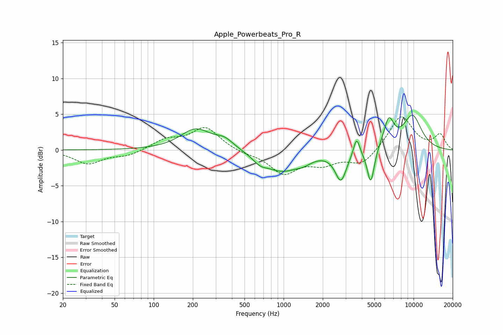

# Apple_Powerbeats_Pro_R
See [usage instructions](https://github.com/jaakkopasanen/AutoEq#usage) for more options and info.

### Parametric EQs
Apply preamp of -5.0 dB when using parametric equalizer.

|   # | Type    |   Fc (Hz) |    Q |   Gain (dB) |
|-----|---------|-----------|------|-------------|
|   1 | Peaking |       211 | 1.21 |         2.9 |
|   2 | Peaking |       352 | 2.01 |         1.2 |
|   3 | Peaking |       657 | 2.56 |        -0.9 |
|   4 | Peaking |       969 | 1.06 |        -2.8 |
|   5 | Peaking |      1430 | 2.33 |        -0.7 |
|   6 | Peaking |      2757 | 3.26 |        -4.1 |
|   7 | Peaking |      3641 | 6    |         2.5 |
|   8 | Peaking |      4681 | 5.13 |        -5   |
|   9 | Peaking |      6445 | 3.48 |         3.8 |
|  10 | Peaking |      9791 | 1.66 |         4.7 |

### Fixed Band EQs
When using fixed band (also called graphic) equalizer, apply preamp of **-4.7 dB** (if available) and set gains manually with these parameters.

|   # | Type    |   Fc (Hz) |    Q |   Gain (dB) |
|-----|---------|-----------|------|-------------|
|   1 | Peaking |        31 | 1.41 |        -1.9 |
|   2 | Peaking |        62 | 1.41 |        -0.8 |
|   3 | Peaking |       125 | 1.41 |         1.4 |
|   4 | Peaking |       250 | 1.41 |         3.1 |
|   5 | Peaking |       500 | 1.41 |        -0.4 |
|   6 | Peaking |      1000 | 1.41 |        -3.1 |
|   7 | Peaking |      2000 | 1.41 |        -1.7 |
|   8 | Peaking |      4000 | 1.41 |        -2.1 |
|   9 | Peaking |      8000 | 1.41 |         4.9 |
|  10 | Peaking |     16000 | 1.41 |         2.1 |

### Graphs

