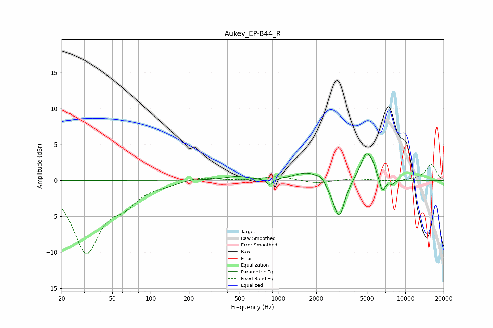

# Aukey_EP-B44_R
See [usage instructions](https://github.com/jaakkopasanen/AutoEq#usage) for more options and info.

### Parametric EQs
Apply preamp of -3.8 dB when using parametric equalizer.

|   # | Type    |   Fc (Hz) |    Q |   Gain (dB) |
|-----|---------|-----------|------|-------------|
|   1 | Peaking |       476 | 1.58 |         0.5 |
|   2 | Peaking |       857 | 6    |        -0.9 |
|   3 | Peaking |      1720 | 1.39 |         1.3 |
|   4 | Peaking |      2176 | 5.09 |         0.5 |
|   5 | Peaking |      2781 | 2.51 |        -1.2 |
|   6 | Peaking |      3038 | 3.43 |        -4.5 |
|   7 | Peaking |      4947 | 2.9  |         4   |
|   8 | Peaking |      5555 | 6    |         0.7 |
|   9 | Peaking |      6613 | 6    |        -2.1 |
|  10 | Peaking |      7846 | 6    |        -0.6 |

### Fixed Band EQs
When using fixed band (also called graphic) equalizer, apply preamp of **-2.3 dB** (if available) and set gains manually with these parameters.

|   # | Type    |   Fc (Hz) |    Q |   Gain (dB) |
|-----|---------|-----------|------|-------------|
|   1 | Peaking |        31 | 1.41 |        -9.8 |
|   2 | Peaking |        62 | 1.41 |        -2.4 |
|   3 | Peaking |       125 | 1.41 |        -0.4 |
|   4 | Peaking |       250 | 1.41 |         0.5 |
|   5 | Peaking |       500 | 1.41 |        -0   |
|   6 | Peaking |      1000 | 1.41 |         0.6 |
|   7 | Peaking |      2000 | 1.41 |        -0.4 |
|   8 | Peaking |      4000 | 1.41 |         0.3 |
|   9 | Peaking |      8000 | 1.41 |        -0.2 |
|  10 | Peaking |     16000 | 1.41 |         2.2 |

### Graphs

