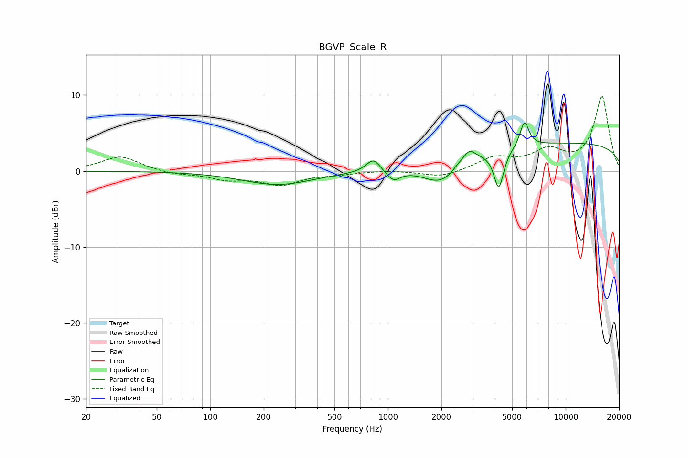

# BGVP_Scale_R
See [usage instructions](https://github.com/jaakkopasanen/AutoEq#usage) for more options and info.

### Parametric EQs
Apply preamp of -6.4 dB when using parametric equalizer.

|   # | Type    |   Fc (Hz) |    Q |   Gain (dB) |
|-----|---------|-----------|------|-------------|
|   1 | Peaking |       240 | 0.72 |        -1.8 |
|   2 | Peaking |       828 | 3.55 |         1.8 |
|   3 | Peaking |      1072 | 3.64 |        -1.4 |
|   4 | Peaking |      1989 | 1.36 |        -2.9 |
|   5 | Peaking |      2451 | 5.91 |         0.3 |
|   6 | Peaking |      2791 | 5.01 |         0.2 |
|   7 | Peaking |      2867 | 3.69 |         1.5 |
|   8 | Peaking |      4204 | 5.19 |        -5   |
|   9 | Peaking |      5868 | 5.49 |         3.3 |
|  10 | Peaking |     10000 | 0.18 |         3.7 |

### Fixed Band EQs
When using fixed band (also called graphic) equalizer, apply preamp of **-9.9 dB** (if available) and set gains manually with these parameters.

|   # | Type    |   Fc (Hz) |    Q |   Gain (dB) |
|-----|---------|-----------|------|-------------|
|   1 | Peaking |        31 | 1.41 |         2   |
|   2 | Peaking |        62 | 1.41 |        -0.4 |
|   3 | Peaking |       125 | 1.41 |        -1   |
|   4 | Peaking |       250 | 1.41 |        -1.7 |
|   5 | Peaking |       500 | 1.41 |        -0.3 |
|   6 | Peaking |      1000 | 1.41 |         0.1 |
|   7 | Peaking |      2000 | 1.41 |        -0.9 |
|   8 | Peaking |      4000 | 1.41 |         1.7 |
|   9 | Peaking |      8000 | 1.41 |         2.4 |
|  10 | Peaking |     16000 | 1.41 |         9.8 |

### Graphs

