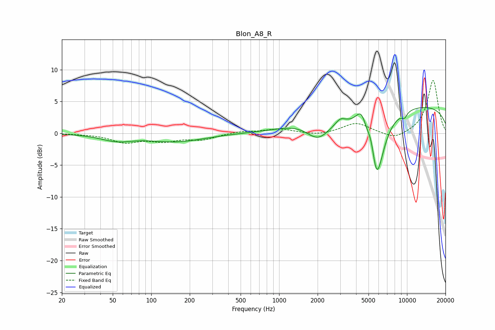

# Blon_A8_R
See [usage instructions](https://github.com/jaakkopasanen/AutoEq#usage) for more options and info.

### Parametric EQs
Apply preamp of -4.1 dB when using parametric equalizer.

|   # | Type    |   Fc (Hz) |    Q |   Gain (dB) |
|-----|---------|-----------|------|-------------|
|   1 | Peaking |        54 | 1.15 |        -1   |
|   2 | Peaking |       157 | 0.65 |        -1.3 |
|   3 | Peaking |      1541 | 0.84 |         0.9 |
|   4 | Peaking |      2017 | 1.45 |        -3.3 |
|   5 | Peaking |      3008 | 3.89 |         0.8 |
|   6 | Peaking |      4392 | 3.43 |         3   |
|   7 | Peaking |      5306 | 4.33 |         3.5 |
|   8 | Peaking |      5731 | 2.32 |       -12.4 |
|   9 | Peaking |      9545 | 5.95 |        -0.9 |
|  10 | Peaking |     10000 | 0.18 |         4.5 |

### Fixed Band EQs
When using fixed band (also called graphic) equalizer, apply preamp of **-8.4 dB** (if available) and set gains manually with these parameters.

|   # | Type    |   Fc (Hz) |    Q |   Gain (dB) |
|-----|---------|-----------|------|-------------|
|   1 | Peaking |        31 | 1.41 |        -0.1 |
|   2 | Peaking |        62 | 1.41 |        -1.3 |
|   3 | Peaking |       125 | 1.41 |        -1.1 |
|   4 | Peaking |       250 | 1.41 |        -0.9 |
|   5 | Peaking |       500 | 1.41 |         0.3 |
|   6 | Peaking |      1000 | 1.41 |         0.7 |
|   7 | Peaking |      2000 | 1.41 |        -0.4 |
|   8 | Peaking |      4000 | 1.41 |         1.6 |
|   9 | Peaking |      8000 | 1.41 |        -1.1 |
|  10 | Peaking |     16000 | 1.41 |         8.4 |

### Graphs

