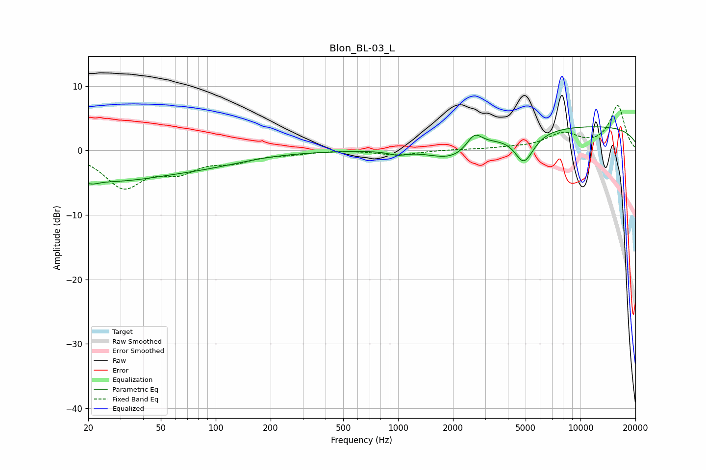

# Blon_BL-03_L
See [usage instructions](https://github.com/jaakkopasanen/AutoEq#usage) for more options and info.

### Parametric EQs
Apply preamp of -3.8 dB when using parametric equalizer.

|   # | Type    |   Fc (Hz) |    Q |   Gain (dB) |
|-----|---------|-----------|------|-------------|
|   1 | Peaking |        21 | 5.36 |        -4   |
|   2 | Peaking |        21 | 5.8  |         3.3 |
|   3 | Peaking |        25 | 0.4  |        -4.5 |
|   4 | Peaking |        93 | 0.61 |        -1.3 |
|   5 | Peaking |       995 | 2.77 |        -0.6 |
|   6 | Peaking |      2013 | 1.07 |        -2.8 |
|   7 | Peaking |      2619 | 3.29 |         2.4 |
|   8 | Peaking |      4795 | 3.64 |        -1   |
|   9 | Peaking |      4955 | 2.46 |        -3.7 |
|  10 | Peaking |     10000 | 0.18 |         3.8 |

### Fixed Band EQs
When using fixed band (also called graphic) equalizer, apply preamp of **-7.1 dB** (if available) and set gains manually with these parameters.

|   # | Type    |   Fc (Hz) |    Q |   Gain (dB) |
|-----|---------|-----------|------|-------------|
|   1 | Peaking |        31 | 1.41 |        -5.4 |
|   2 | Peaking |        62 | 1.41 |        -2.7 |
|   3 | Peaking |       125 | 1.41 |        -1.4 |
|   4 | Peaking |       250 | 1.41 |        -0.4 |
|   5 | Peaking |       500 | 1.41 |         0.1 |
|   6 | Peaking |      1000 | 1.41 |        -0.7 |
|   7 | Peaking |      2000 | 1.41 |         0.1 |
|   8 | Peaking |      4000 | 1.41 |         0.3 |
|   9 | Peaking |      8000 | 1.41 |         2.4 |
|  10 | Peaking |     16000 | 1.41 |         6.9 |

### Graphs

