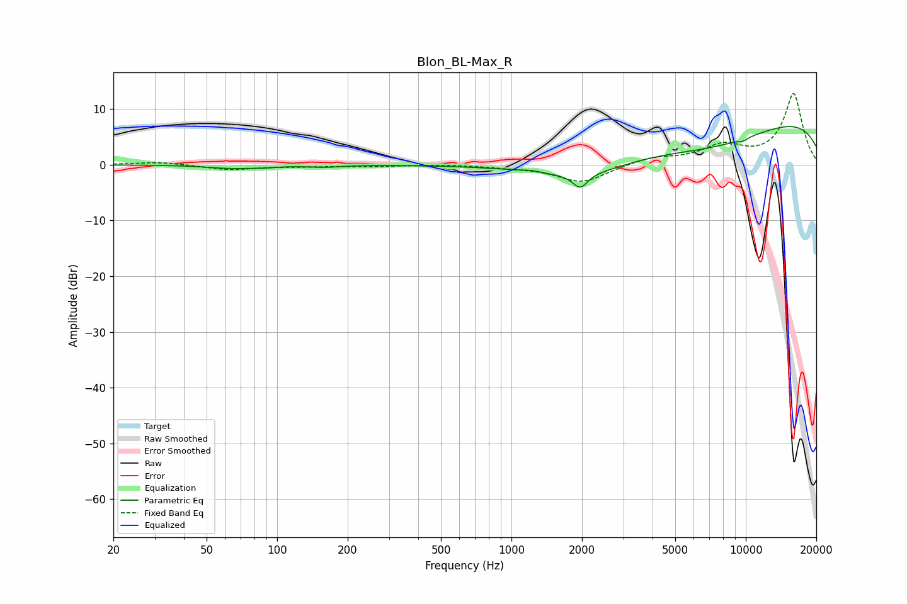

# Blon_BL-Max_R
See [usage instructions](https://github.com/jaakkopasanen/AutoEq#usage) for more options and info.

### Parametric EQs
Apply preamp of -7.0 dB when using parametric equalizer.

|   # | Type    |   Fc (Hz) |    Q |   Gain (dB) |
|-----|---------|-----------|------|-------------|
|   1 | Peaking |        63 | 1.36 |        -0.6 |
|   2 | Peaking |        88 | 2.57 |        -0.3 |
|   3 | Peaking |       159 | 2.27 |        -0.4 |
|   4 | Peaking |      1215 | 3.78 |         0.3 |
|   5 | Peaking |      1964 | 4.62 |        -2.5 |
|   6 | Peaking |      2099 | 0.6  |        -4.6 |
|   7 | Peaking |      7071 | 0.47 |        -5.3 |
|   8 | Peaking |      9773 | 6    |        -0.5 |
|   9 | Peaking |     10000 | 0.18 |         9.6 |
|  10 | Peaking |     10000 | 6    |         0.1 |

### Fixed Band EQs
When using fixed band (also called graphic) equalizer, apply preamp of **-12.9 dB** (if available) and set gains manually with these parameters.

|   # | Type    |   Fc (Hz) |    Q |   Gain (dB) |
|-----|---------|-----------|------|-------------|
|   1 | Peaking |        31 | 1.41 |         0.5 |
|   2 | Peaking |        62 | 1.41 |        -0.9 |
|   3 | Peaking |       125 | 1.41 |        -0.2 |
|   4 | Peaking |       250 | 1.41 |        -0.3 |
|   5 | Peaking |       500 | 1.41 |         0.1 |
|   6 | Peaking |      1000 | 1.41 |        -0.3 |
|   7 | Peaking |      2000 | 1.41 |        -3.2 |
|   8 | Peaking |      4000 | 1.41 |         1.2 |
|   9 | Peaking |      8000 | 1.41 |         3.1 |
|  10 | Peaking |     16000 | 1.41 |        12.7 |

### Graphs

