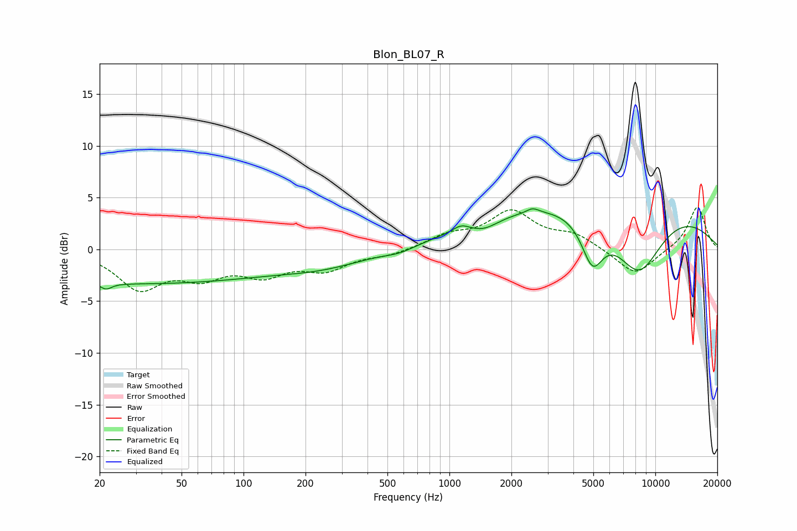

# Blon_BL07_R
See [usage instructions](https://github.com/jaakkopasanen/AutoEq#usage) for more options and info.

### Parametric EQs
Apply preamp of -4.0 dB when using parametric equalizer.

|   # | Type    |   Fc (Hz) |    Q |   Gain (dB) |
|-----|---------|-----------|------|-------------|
|   1 | Peaking |        22 | 5.37 |        -0.6 |
|   2 | Peaking |        29 | 0.18 |        -3.3 |
|   3 | Peaking |       252 | 0.65 |        -1.1 |
|   4 | Peaking |       572 | 1.87 |        -0.5 |
|   5 | Peaking |      1140 | 3.46 |         0.6 |
|   6 | Peaking |      1471 | 2.04 |        -0.8 |
|   7 | Peaking |      2535 | 4.97 |         0.4 |
|   8 | Peaking |      4951 | 2.6  |        -4.4 |
|   9 | Peaking |      5868 | 0.21 |         5.2 |
|  10 | Peaking |      8299 | 1.08 |        -6.6 |

### Fixed Band EQs
When using fixed band (also called graphic) equalizer, apply preamp of **-4.2 dB** (if available) and set gains manually with these parameters.

|   # | Type    |   Fc (Hz) |    Q |   Gain (dB) |
|-----|---------|-----------|------|-------------|
|   1 | Peaking |        31 | 1.41 |        -3.6 |
|   2 | Peaking |        62 | 1.41 |        -2.2 |
|   3 | Peaking |       125 | 1.41 |        -2.1 |
|   4 | Peaking |       250 | 1.41 |        -1.8 |
|   5 | Peaking |       500 | 1.41 |        -0.5 |
|   6 | Peaking |      1000 | 1.41 |         1.2 |
|   7 | Peaking |      2000 | 1.41 |         3.5 |
|   8 | Peaking |      4000 | 1.41 |         1.3 |
|   9 | Peaking |      8000 | 1.41 |        -2.6 |
|  10 | Peaking |     16000 | 1.41 |         4.2 |

### Graphs

