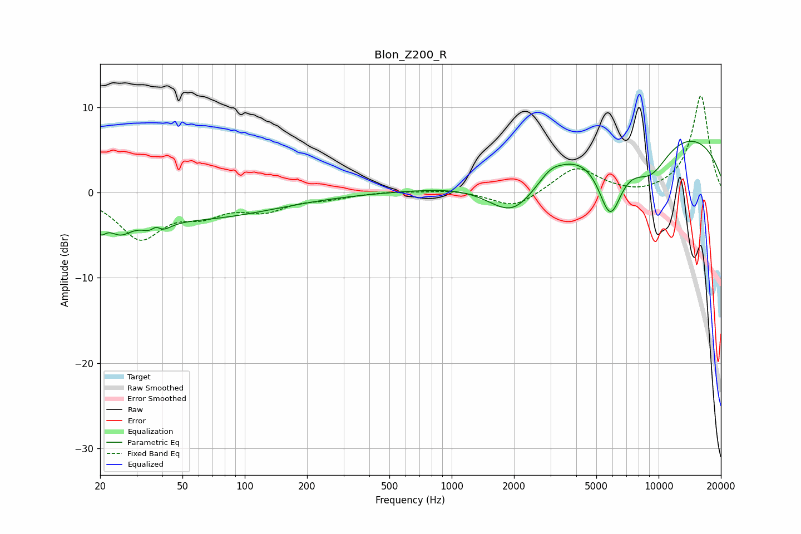

# Blon_Z200_R
See [usage instructions](https://github.com/jaakkopasanen/AutoEq#usage) for more options and info.

### Parametric EQs
Apply preamp of -6.1 dB when using parametric equalizer.

|   # | Type    |   Fc (Hz) |    Q |   Gain (dB) |
|-----|---------|-----------|------|-------------|
|   1 | Peaking |        20 | 5.41 |        -2.1 |
|   2 | Peaking |        25 | 2.35 |        -2.4 |
|   3 | Peaking |        37 | 5.1  |         2.6 |
|   4 | Peaking |        37 | 3.35 |        -3.5 |
|   5 | Peaking |        58 | 0.37 |        -2.9 |
|   6 | Peaking |      1997 | 1.04 |        -6.1 |
|   7 | Peaking |      3005 | 3.02 |         0.7 |
|   8 | Peaking |      5834 | 2.25 |        -7.9 |
|   9 | Peaking |      8360 | 0.19 |         8.2 |
|  10 | Peaking |      9098 | 1.25 |        -4.8 |

### Fixed Band EQs
When using fixed band (also called graphic) equalizer, apply preamp of **-11.4 dB** (if available) and set gains manually with these parameters.

|   # | Type    |   Fc (Hz) |    Q |   Gain (dB) |
|-----|---------|-----------|------|-------------|
|   1 | Peaking |        31 | 1.41 |        -5.1 |
|   2 | Peaking |        62 | 1.41 |        -2   |
|   3 | Peaking |       125 | 1.41 |        -1.8 |
|   4 | Peaking |       250 | 1.41 |        -0.6 |
|   5 | Peaking |       500 | 1.41 |         0.2 |
|   6 | Peaking |      1000 | 1.41 |         0.3 |
|   7 | Peaking |      2000 | 1.41 |        -1.9 |
|   8 | Peaking |      4000 | 1.41 |         3   |
|   9 | Peaking |      8000 | 1.41 |        -0.4 |
|  10 | Peaking |     16000 | 1.41 |        11.4 |

### Graphs

