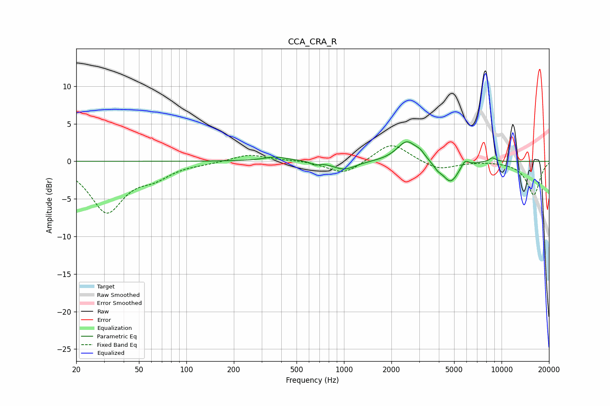

# CCA_CRA_R
See [usage instructions](https://github.com/jaakkopasanen/AutoEq#usage) for more options and info.

### Parametric EQs
Apply preamp of -2.7 dB when using parametric equalizer.

|   # | Type    |   Fc (Hz) |    Q |   Gain (dB) |
|-----|---------|-----------|------|-------------|
|   1 | Peaking |       360 | 3.29 |         0.2 |
|   2 | Peaking |       377 | 1.32 |         0.4 |
|   3 | Peaking |       652 | 5.96 |        -0.4 |
|   4 | Peaking |      1006 | 1.97 |        -1.1 |
|   5 | Peaking |      2507 | 2.26 |         2.7 |
|   6 | Peaking |      3049 | 5.07 |         0.6 |
|   7 | Peaking |      3924 | 5.2  |        -0.6 |
|   8 | Peaking |      4745 | 2.75 |        -2.8 |
|   9 | Peaking |      5850 | 5.96 |         0.9 |
|  10 | Peaking |      8759 | 6    |         0.6 |

### Fixed Band EQs
When using fixed band (also called graphic) equalizer, apply preamp of **-2.2 dB** (if available) and set gains manually with these parameters.

|   # | Type    |   Fc (Hz) |    Q |   Gain (dB) |
|-----|---------|-----------|------|-------------|
|   1 | Peaking |        31 | 1.41 |        -6.6 |
|   2 | Peaking |        62 | 1.41 |        -1.7 |
|   3 | Peaking |       125 | 1.41 |        -0.2 |
|   4 | Peaking |       250 | 1.41 |         1   |
|   5 | Peaking |       500 | 1.41 |         0.2 |
|   6 | Peaking |      1000 | 1.41 |        -1.8 |
|   7 | Peaking |      2000 | 1.41 |         2.6 |
|   8 | Peaking |      4000 | 1.41 |        -1.2 |
|   9 | Peaking |      8000 | 1.41 |         0.1 |
|  10 | Peaking |     16000 | 1.41 |        -4.5 |

### Graphs

