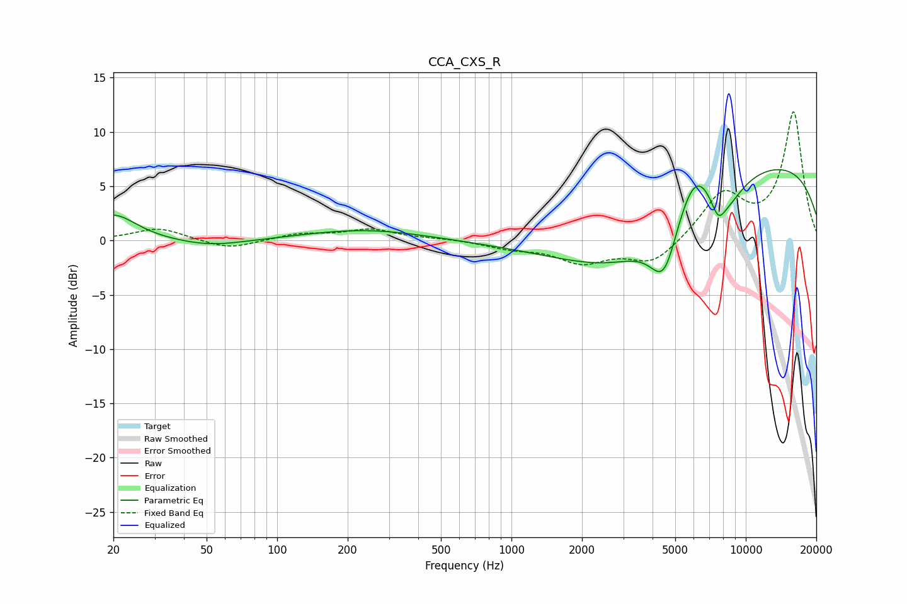

# CCA_CXS_R
See [usage instructions](https://github.com/jaakkopasanen/AutoEq#usage) for more options and info.

### Parametric EQs
Apply preamp of -6.6 dB when using parametric equalizer.

|   # | Type    |   Fc (Hz) |    Q |   Gain (dB) |
|-----|---------|-----------|------|-------------|
|   1 | Peaking |        20 | 1.47 |         2.4 |
|   2 | Peaking |        52 | 0.97 |        -0.6 |
|   3 | Peaking |       237 | 0.55 |         1   |
|   4 | Peaking |      3019 | 0.47 |        -7.1 |
|   5 | Peaking |      4352 | 2.19 |        -1.5 |
|   6 | Peaking |      4517 | 2.64 |        -3.3 |
|   7 | Peaking |      6054 | 1.78 |         4.1 |
|   8 | Peaking |      7625 | 4.12 |        -2   |
|   9 | Peaking |      8327 | 1.73 |        -2.3 |
|  10 | Peaking |      9299 | 0.18 |         7.9 |

### Fixed Band EQs
When using fixed band (also called graphic) equalizer, apply preamp of **-11.9 dB** (if available) and set gains manually with these parameters.

|   # | Type    |   Fc (Hz) |    Q |   Gain (dB) |
|-----|---------|-----------|------|-------------|
|   1 | Peaking |        31 | 1.41 |         1.2 |
|   2 | Peaking |        62 | 1.41 |        -0.9 |
|   3 | Peaking |       125 | 1.41 |         0.6 |
|   4 | Peaking |       250 | 1.41 |         1   |
|   5 | Peaking |       500 | 1.41 |         0.2 |
|   6 | Peaking |      1000 | 1.41 |        -0.6 |
|   7 | Peaking |      2000 | 1.41 |        -1.9 |
|   8 | Peaking |      4000 | 1.41 |        -2.2 |
|   9 | Peaking |      8000 | 1.41 |         4.2 |
|  10 | Peaking |     16000 | 1.41 |        11.8 |

### Graphs

