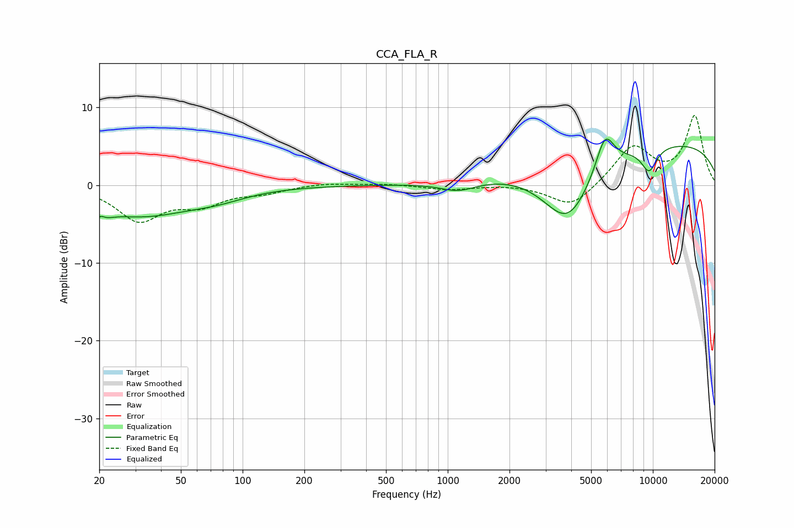

# CCA_FLA_R
See [usage instructions](https://github.com/jaakkopasanen/AutoEq#usage) for more options and info.

### Parametric EQs
Apply preamp of -6.0 dB when using parametric equalizer.

|   # | Type    |   Fc (Hz) |    Q |   Gain (dB) |
|-----|---------|-----------|------|-------------|
|   1 | Peaking |        20 | 4    |        -3.7 |
|   2 | Peaking |        20 | 5.57 |         2.6 |
|   3 | Peaking |        32 | 0.56 |        -3.7 |
|   4 | Peaking |        75 | 0.98 |        -0.9 |
|   5 | Peaking |      1086 | 1.56 |         0.4 |
|   6 | Peaking |      1118 | 1.57 |        -1.7 |
|   7 | Peaking |      3848 | 1.08 |        -8.7 |
|   8 | Peaking |      5842 | 3.01 |         4.9 |
|   9 | Peaking |      9580 | 0.18 |         5.7 |
|  10 | Peaking |      9591 | 3.25 |        -3.1 |

### Fixed Band EQs
When using fixed band (also called graphic) equalizer, apply preamp of **-9.1 dB** (if available) and set gains manually with these parameters.

|   # | Type    |   Fc (Hz) |    Q |   Gain (dB) |
|-----|---------|-----------|------|-------------|
|   1 | Peaking |        31 | 1.41 |        -4.4 |
|   2 | Peaking |        62 | 1.41 |        -2.2 |
|   3 | Peaking |       125 | 1.41 |        -0.8 |
|   4 | Peaking |       250 | 1.41 |         0.3 |
|   5 | Peaking |       500 | 1.41 |         0.2 |
|   6 | Peaking |      1000 | 1.41 |        -0.6 |
|   7 | Peaking |      2000 | 1.41 |         0.1 |
|   8 | Peaking |      4000 | 1.41 |        -3   |
|   9 | Peaking |      8000 | 1.41 |         5   |
|  10 | Peaking |     16000 | 1.41 |         8.8 |

### Graphs

