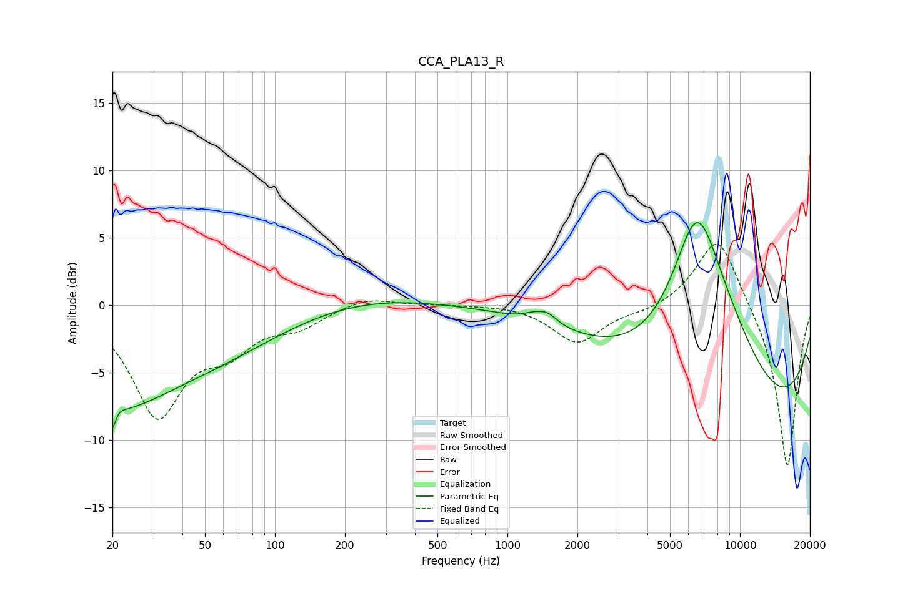

# CCA_PLA13_R
See [usage instructions](https://github.com/jaakkopasanen/AutoEq#usage) for more options and info.

### Parametric EQs
Apply preamp of -6.2 dB when using parametric equalizer.

|   # | Type    |   Fc (Hz) |    Q |   Gain (dB) |
|-----|---------|-----------|------|-------------|
|   1 | Peaking |        20 | 0.56 |        -6.3 |
|   2 | Peaking |        20 | 5.05 |        -5   |
|   3 | Peaking |        21 | 5.25 |         3.6 |
|   4 | Peaking |        57 | 0.47 |        -2.6 |
|   5 | Peaking |       242 | 0.47 |         0.8 |
|   6 | Peaking |      1275 | 3.67 |         0.3 |
|   7 | Peaking |      1479 | 3.24 |         0.8 |
|   8 | Peaking |      6502 | 1.24 |        10.1 |
|   9 | Peaking |      8190 | 0.64 |         5.9 |
|  10 | Peaking |     10000 | 0.23 |        -9.9 |

### Fixed Band EQs
When using fixed band (also called graphic) equalizer, apply preamp of **-4.6 dB** (if available) and set gains manually with these parameters.

|   # | Type    |   Fc (Hz) |    Q |   Gain (dB) |
|-----|---------|-----------|------|-------------|
|   1 | Peaking |        31 | 1.41 |        -7.9 |
|   2 | Peaking |        62 | 1.41 |        -2.6 |
|   3 | Peaking |       125 | 1.41 |        -1.3 |
|   4 | Peaking |       250 | 1.41 |         0.7 |
|   5 | Peaking |       500 | 1.41 |         0.1 |
|   6 | Peaking |      1000 | 1.41 |         0.1 |
|   7 | Peaking |      2000 | 1.41 |        -2.8 |
|   8 | Peaking |      4000 | 1.41 |        -0.4 |
|   9 | Peaking |      8000 | 1.41 |         5.4 |
|  10 | Peaking |     16000 | 1.41 |       -12.2 |

### Graphs

